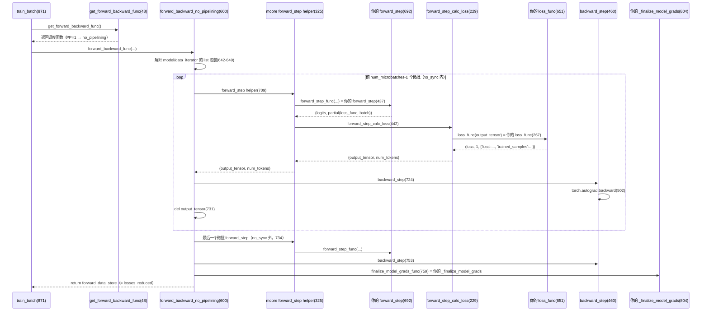

# Megatron Core 调度内部：`forward_backward_func()` 一次调用的完整调用链

本笔记回答一个具体问题：`train_batch` 里那一行 `losses_reduced = forward_backward_func(...)` 进去之后，Megatron Core 内部到底按什么顺序调了谁、什么时候回调回 nano 的代码。

结论先行：**这是一次同步调用，前向 → 算 loss → 反向 → 梯度收尾全部在调用内部跑完；控制权以「回调」的方式流回 nano（`forward_step` / `loss_func` / `_finalize_model_grads`），mcore 自身不含任何 GRPO 语义。**

本文与 [`tp-megatron-calling-boundary.md`](./tp-megatron-calling-boundary.md) 互补：那份讲「调用方负责什么、Megatron 代劳什么」的分工边界；这份讲「控制权进了 mcore 之后，内部每一步调了谁」。

## 1. 入口：`train_batch` 的两行

```python
# megatron_trainer.py:870-871
forward_backward_func = get_forward_backward_func()   # ① 按 pp_size 选调度函数
losses_reduced = forward_backward_func(               # ② 一次同步调用，跑完全程
    forward_step_func=self.forward_step,              #    前向回调（传引用，不调用）
    data_iterator=iter(batches),                      #    微批迭代器
    model=[self.model],                               #    模型**列表**（mcore 会解开）
    num_microbatches=len(batches),                    #    微批数
    seq_length=batches[0]["seq_length"],              #    bshd 的全局序列长
    micro_batch_size=microbatch_size,                 #    每微批样本数
    forward_only=False,                               #    False=要反向
)
```

- **① `get_forward_backward_func()`**（[megatron_trainer.py:870](../../toy_rl/trainer/megatron_trainer.py#L870)）按 `pp_size` 选调度函数。
- **② `forward_backward_func(...)`**（[megatron_trainer.py:871](../../toy_rl/trainer/megatron_trainer.py#L871)）把四个实参交给调度函数，**同步阻塞直到全部微批的前向/loss/反向/finalize 跑完**，返回 `losses_reduced`。

## 2. 全景时序图（谁调谁）



## 3. 第一步：`get_forward_backward_func()` 选型

[`get_forward_backward_func()`](../../.venv/lib/python3.13/site-packages/megatron/core/pipeline_parallel/schedules.py#L48) 按 `pp_size` / `vp_size` 返回不同的调度函数：

| 条件 | 返回的调度函数 | 位置 |
| --- | --- | --- |
| PP=1 | `forward_backward_no_pipelining` | [schedules.py:600](../../.venv/lib/python3.13/site-packages/megatron/core/pipeline_parallel/schedules.py#L600) |
| PP>1 且无 VPP | `forward_backward_pipelining_without_interleaving`（1F1B） | [schedules.py:2055](../../.venv/lib/python3.13/site-packages/megatron/core/pipeline_parallel/schedules.py#L2055) |
| PP>1 且有 VPP | `forward_backward_pipelining_with_interleaving` | schedules.py 内 |

nano 未开 VPP（偏离登记见 `megatron_trainer.py` 模块 docstring），故只有前两条路径。本笔记主要拆 PP=1 的 `forward_backward_no_pipelining`（无 MoE、无 hybrid CP，走标准 `else` 分支）。

## 4. `forward_backward_no_pipelining` 逐行拆解（PP=1 标准路径）

### 4.1 骨架

| # | 位置 | 做什么 |
| --- | --- | --- |
| 1 | [schedules.py:642-649](../../.venv/lib/python3.13/site-packages/megatron/core/pipeline_parallel/schedules.py#L642-L649) | **解开 list 包装**：断言 `len(model)==1` 再 `model = model[0]`；`data_iterator` 同理。这就是 `model=[self.model]` 必须传列表的原因 |
| 2 | [schedules.py:654](../../.venv/lib/python3.13/site-packages/megatron/core/pipeline_parallel/schedules.py#L654) | `config = get_model_config(model)`，取出 `TransformerConfig` |
| 3 | [schedules.py:669](../../.venv/lib/python3.13/site-packages/megatron/core/pipeline_parallel/schedules.py#L669) | 初始化 `total_num_tokens`（各微批 token 数累加器） |
| 4 | [schedules.py:671](../../.venv/lib/python3.13/site-packages/megatron/core/pipeline_parallel/schedules.py#L671) | MoE overlap 分支 —— **nano 不命中，跳过** |
| 5 | [schedules.py:687](../../.venv/lib/python3.13/site-packages/megatron/core/pipeline_parallel/schedules.py#L687) | hybrid CP 分支 —— **nano 不命中，跳过** |
| 6 | [schedules.py:706](../../.venv/lib/python3.13/site-packages/megatron/core/pipeline_parallel/schedules.py#L706) | `else:` 进入标准路径 |

### 4.2 微批循环（前 num_microbatches-1 个）

| # | 位置 | 做什么 |
| --- | --- | --- |
| 1 | [schedules.py:707](../../.venv/lib/python3.13/site-packages/megatron/core/pipeline_parallel/schedules.py#L707) | `with no_sync_func():` 包住循环（无 DDP 的 nano 是 `contextlib.nullcontext`，无影响） |
| 2 | [schedules.py:708](../../.venv/lib/python3.13/site-packages/megatron/core/pipeline_parallel/schedules.py#L708) | `for i in range(num_microbatches - 1)`：循环除最后一个外的所有微批 |
| 3 | [schedules.py:709](../../.venv/lib/python3.13/site-packages/megatron/core/pipeline_parallel/schedules.py#L709) | 调**模块级** `forward_step` helper（见 §4.3） |
| 4 | [schedules.py:722](../../.venv/lib/python3.13/site-packages/megatron/core/pipeline_parallel/schedules.py#L722) | `total_num_tokens += num_tokens` |
| 5 | [schedules.py:724](../../.venv/lib/python3.13/site-packages/megatron/core/pipeline_parallel/schedules.py#L724) | `backward_step(...)`（见 §4.5） |
| 6 | [schedules.py:731](../../.venv/lib/python3.13/site-packages/megatron/core/pipeline_parallel/schedules.py#L731) | `del output_tensor` 释放 autograd 图头（防跨微批 graph 泄漏，mcore #4124） |

### 4.3 模块级 `forward_step` helper（mcore 自己的，不是你的）

定义在 [schedules.py:325](../../.venv/lib/python3.13/site-packages/megatron/core/pipeline_parallel/schedules.py#L325)。它做三件事：

| # | 位置 | 做什么 |
| --- | --- | --- |
| 1 | [schedules.py:437](../../.venv/lib/python3.13/site-packages/megatron/core/pipeline_parallel/schedules.py#L437) | `forward_step_func(data_iterator, model)` ← **回调你的 `forward_step`**（[megatron_trainer.py:692](../../toy_rl/trainer/megatron_trainer.py#L692)） |
| 2 | [schedules.py:442](../../.venv/lib/python3.13/site-packages/megatron/core/pipeline_parallel/schedules.py#L442) | 调 `forward_step_calc_loss`（见 §4.4） |
| 3 | — | 返回 `(output_tensor, num_tokens)` |

**这一层是「名字相同、层级不同」最容易看混的地方**：`schedules.py:325` 的 `forward_step` 是 mcore 的调度原语，`megatron_trainer.py:692` 的 `forward_step` 是被它用 `forward_step_func` 这个名字**回调**的 nano 方法，不是同一个函数。跳转时先认层级：325 行是 mcore，437 行 `forward_step_func(...)` 那一步才跳进 nano。

### 4.4 `forward_step_calc_loss`：算 loss

定义在 [schedules.py:229](../../.venv/lib/python3.13/site-packages/megatron/core/pipeline_parallel/schedules.py#L229)。它只在 last stage 调 loss：

| # | 位置 | 做什么 |
| --- | --- | --- |
| 1 | [schedules.py:267](../../.venv/lib/python3.13/site-packages/megatron/core/pipeline_parallel/schedules.py#L267) | `loss_func(output_tensor)` ← **回调你的 `loss_func`**（[megatron_trainer.py:651](../../toy_rl/trainer/megatron_trainer.py#L651)） |
| 2 | [schedules.py:274](../../.venv/lib/python3.13/site-packages/megatron/core/pipeline_parallel/schedules.py#L274) | `output_tensor /= num_microbatches`（与 `loss_func` 里的 `× num_microbatches` 抵消） |
| 3 | — | 把 loss 的第三项（log dict）append 进 `forward_data_store` |

### 4.5 `backward_step`：反向

定义在 [schedules.py:460](../../.venv/lib/python3.13/site-packages/megatron/core/pipeline_parallel/schedules.py#L460)。核心是：

- [schedules.py:502](../../.venv/lib/python3.13/site-packages/megatron/core/pipeline_parallel/schedules.py#L502)：`torch.autograd.backward(output_tensor, grad_tensors=...)` 真正的反向。

### 4.6 最后一个微批 + finalize

| # | 位置 | 做什么 |
| --- | --- | --- |
| 1 | [schedules.py:734](../../.venv/lib/python3.13/site-packages/megatron/core/pipeline_parallel/schedules.py#L734) | **最后一个微批**的 `forward_step`（故意放 `no_sync` **外面**，要同步梯度） |
| 2 | [schedules.py:750](../../.venv/lib/python3.13/site-packages/megatron/core/pipeline_parallel/schedules.py#L750) | `total_num_tokens += num_tokens` |
| 3 | [schedules.py:753](../../.venv/lib/python3.13/site-packages/megatron/core/pipeline_parallel/schedules.py#L753) | 最后一个微批的 `backward_step` |
| 4 | [schedules.py:754](../../.venv/lib/python3.13/site-packages/megatron/core/pipeline_parallel/schedules.py#L754) | `del output_tensor` |
| 5 | [schedules.py:756](../../.venv/lib/python3.13/site-packages/megatron/core/pipeline_parallel/schedules.py#L756) | `if config.finalize_model_grads_func is not None and not forward_only:` |
| 6 | [schedules.py:759](../../.venv/lib/python3.13/site-packages/megatron/core/pipeline_parallel/schedules.py#L759) | `config.finalize_model_grads_func(...)` ← **回调 nano 挂的 `_finalize_model_grads`**（[megatron_trainer.py:804](../../toy_rl/trainer/megatron_trainer.py#L804)） |

`_finalize_model_grads` 是 nano 在 `__init__` 里挂到 config 上的钩子（[megatron_trainer.py:374](../../toy_rl/trainer/megatron_trainer.py#L374)），反向结束后由 mcore **自动调用**，不在 `train_batch` 里显式调。

## 5. 三个「名字相同但层级不同」的坑

| 名字 | mcore 模块级（调度原语） | nano 方法（被回调） |
| --- | --- | --- |
| `forward_step` | [schedules.py:325](../../.venv/lib/python3.13/site-packages/megatron/core/pipeline_parallel/schedules.py#L325) | [megatron_trainer.py:692](../../toy_rl/trainer/megatron_trainer.py#L692) |
| `backward_step` | [schedules.py:460](../../.venv/lib/python3.13/site-packages/megatron/core/pipeline_parallel/schedules.py#L460) | （无同名，nano 不写） |
| `forward_step_calc_loss` | [schedules.py:229](../../.venv/lib/python3.13/site-packages/megatron/core/pipeline_parallel/schedules.py#L229) | （无同名，nano 不写） |

**跳转规则**：看到 `schedules.py` 里的 `forward_step` 是 mcore 的；只有 `schedules.py:437` 的 `forward_step_func(...)` 和 `schedules.py:267` 的 `loss_func(output_tensor)` 那两步，才跳回 nano。

## 6. PP>1 的分岔：1F1B

PP>1 时 `get_forward_backward_func()` 返回 [`forward_backward_pipelining_without_interleaving`](../../.venv/lib/python3.13/site-packages/megatron/core/pipeline_parallel/schedules.py#L2055)，调度从「顺序循环」变成「1F1B 流水线」：

- **前向发生在每个 stage**：每个 stage 都调自己的 `forward_step`，中间 stage 的 `output_tensor` 是 hidden states，通过 p2p 发给下一个 stage，**不算 loss**。
- **算 loss 只在 last stage**：只有 last stage 调 `forward_step_calc_loss` → `loss_func`。
- 这就是 nano 把 `forward_step`（纯前向）与 `loss_func`（算 loss）**拆开**的原因 —— 见 [megatron_trainer.py:692](../../toy_rl/trainer/megatron_trainer.py#L692) 的 docstring。

## 7. 返回值与回 `train_batch` 的收尾

`forward_backward_func(...)` 返回 `forward_data_store`，即每个微批一个 log dict 的列表（dict 来自 `loss_func` 三元组的第三项）：

```python
# megatron_trainer.py:651 loss_func 的返回
return (
    loss,                                            # 第一项：给 backward
    torch.tensor(1, device=logits.device),           # 第二项：num_tokens
    {"loss": loss.detach(), "trained_samples": len(losses)},  # 第三项：进 losses_reduced
)
```

回到 `train_batch` 后（[megatron_trainer.py:883-889](../../toy_rl/trainer/megatron_trainer.py#L883-L889)）：

| # | 位置 | 做什么 |
| --- | --- | --- |
| 1 | [megatron_trainer.py:883](../../toy_rl/trainer/megatron_trainer.py#L883) | `clip_grad_norm_` 梯度裁剪（在 finalize 之后，裁的是规约完的完整梯度） |
| 2 | [megatron_trainer.py:884](../../toy_rl/trainer/megatron_trainer.py#L884) | `optimizer.step()` |
| 3 | [megatron_trainer.py:888-889](../../toy_rl/trainer/megatron_trainer.py#L888-L889) | `loss_sum` / `trained` 求和 —— **纯报告**，读返回值填最终 dict |
| 4 | [megatron_trainer.py:891-899](../../toy_rl/trainer/megatron_trainer.py#L891-L899) | PP>1 时跨 PP `broadcast`（非 last stage 的 `losses_reduced` 是空列表） |

## 8. 最小心智模型

```python
# 你只写这两样，其余交给 mcore 调度：
def forward_step(data_iterator, model):   # 纯前向 → (logits, loss 偏函数)
    batch = next(data_iterator)
    return model(batch["tokens"]), partial(loss_func, batch)

def loss_func(batch, logits):             # logits → (loss, num_tokens, 日志 dict)
    ...
    return loss, num_tokens, {"loss": loss.detach()}

# mcore 内部替你串起：循环 → forward_step → loss_func → backward → finalize
losses_reduced = forward_backward_func(
    forward_step_func=forward_step, data_iterator=iter(batches),
    model=[model], num_microbatches=N, forward_only=False,
)
```

控制权以**回调**方式流回你的代码（`forward_step` / `loss_func` / `_finalize_model_grads`），mcore 自身只做「调度 + 通信 + 反向」，不含任何 GRPO 语义。

## 9. 建议阅读顺序

1. 先看 §1-2，建立「一次同步调用 + 回调」的直觉。
2. 读 §4 的逐行表，对照 [`forward_backward_no_pipelining`](../../.venv/lib/python3.13/site-packages/megatron/core/pipeline_parallel/schedules.py#L600) 源码。
3. 跳到 §5 的「同名不同层」坑，确认 `schedules.py:437` 与 `schedules.py:267` 两个回调点。
4. 回 `train_batch` 看 §7 的收尾（clip → step → 报告）。
