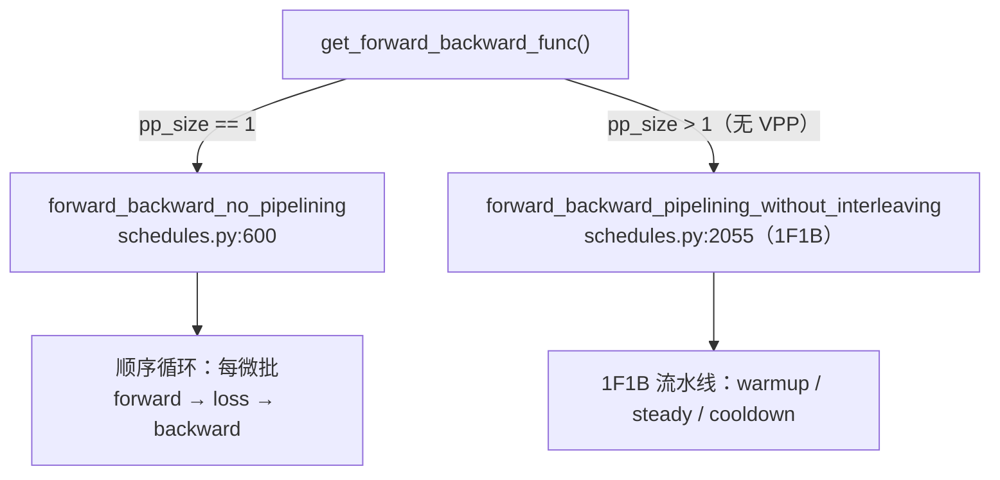
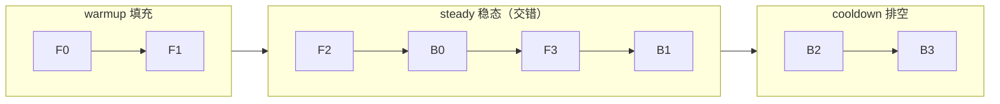

# PP：Pipeline Parallelism（流水线并行）是怎么做的

本笔记回答「开 `--pp 2` 之后，模型怎么被纵向切开、1F1B 调度怎么跑、前向/loss 为什么必须拆开、梯度怎么跨 stage 收尾、权重转换怎么处理层号偏移」。

与 [`tp-sharding-mechanics.md`](./tp-sharding-mechanics.md) 互补：**TP 切的是层内矩阵（行/列），PP 切的是层间（模型纵向）**。两者正交，可以同时开（如 `--tp 2 --pp 2`）。

结论先行：**PP 把模型的层纵向切成若干 stage，每个 stage 持有若干连续层；前向逐 stage 传递 hidden states（p2p），反向逆序回传梯度；loss 只在 last stage 算。nano 只需做四件事——按 stage 角色建模型（`pre_process`/`post_process`）、补一处 tie embedding 的跨 stage 梯度规约、权重转换时处理层号偏移、把非 last stage 的 loss 广播出来。**

## 1. PP 切什么

| 轴 | 切什么 | 通信在哪 | 边界 |
| --- | --- | --- | --- |
| TP | 层内矩阵的行/列 | 层内部 all-reduce | 单层可跨卡 |
| **PP** | **层（模型纵向）** | **stage 边界 p2p send/recv** | **通信最小，但有 bubble** |
| CP | 序列长度维 | attention 内部 ring 交换 KV | 长序列不受单卡显存限制 |

PP=2 时，28 层被切成前后两段（各持约一半层），分别落在两个进程里：

```text
stage 0（first）           stage 1（last）
┌──────────────┐    p2p    ┌──────────────┐
│ embedding    │ ────────▶ │ layers 14-27 │
│ layers 0-13  │  hidden   │ final_norm   │
│              │  states   │ output_layer │──▶ logits
└──────────────┘           └──────────────┘
```

## 2. stage 角色：first / middle / last

PP 把模型纵向切开后，**不同 stage 拥有模型的不同端**：

| stage | 拥有什么 | 标志 |
| --- | --- | --- |
| first | input embedding + 前半层 | `pre_process=True` |
| middle | 只有 transformer 层 | 两者皆 False |
| last | 后半层 + final_layernorm + output_layer，产出 logits | `post_process=True` |

**PP=1 时同一 rank 既是 first 也是 last**，同时拥有模型的输入端和输出端。

对应代码（[`megatron_trainer.py`](../../toy_rl/trainer/megatron_trainer.py)）：

```python
self.is_first_stage = mpu.is_pipeline_first_stage()   # 310
self.is_last_stage  = mpu.is_pipeline_last_stage()    # 311
...
GPTModel(..., pre_process=self.is_first_stage,        # 363
              post_process=self.is_last_stage,        # 364
              ...)
```

**只有 first stage 有 embedding、只有 last stage 有 output_layer + final_layernorm**——这是 PP 的核心事实，后面 §7 的梯度收尾、§8 的权重转换都从它推导出来。

## 3. PP 是怎么被激活的

```python
# ① 建 PP process group（megatron_trainer.py:291）
mpu.initialize_model_parallel(pipeline_model_parallel_size=self.pp_size, ...)

# ② config 里带上 pp_size（megatron_trainer.py:332）
_build_transformer_config(..., pp_size=self.pp_size, ...)
```

rank 布局默认 `order='tp-cp-ep-dp-pp'`：**PP 在最外层**。TP=2×PP=2 时 PP 组是 `[0,2]` / `[1,3]`，跨 NUMA——因为 PP 通信量最小（每 stage 边界一次 p2p），跨组可接受；TP 通信量大放同 NODE 内。见 [`parallel_group_ranks`](../../toy_rl/trainer/megatron_trainer.py#L410)。

## 4. 1F1B 调度（分叉点在 `get_forward_backward_func`）

PP=1 与 PP>1 的分叉发生在 [`get_forward_backward_func()`](../../.venv/lib/python3.13/site-packages/megatron/core/pipeline_parallel/schedules.py#L48)：



**1F1B**（one-forward-one-backward interleaved）三段：



（F=前向，B=反向，下标=微批号。PP=2、4 微批时：先 F0→F1 填满流水线，再交错 F2/B0/F3/B1，最后 B2/B3 排空。）

**前向发生在每个 stage、loss 只在 last stage 算**：中间 stage 的 `output_tensor` 是 hidden states，直接 p2p 送给下一个 stage；只有 last stage 的 output 是 logits，才轮到 `loss_func`。这就是 §5 的根因。

## 5. 前向/loss 为什么必须拆开

[`forward_step`](../../toy_rl/trainer/megatron_trainer.py#L692) 只做**纯前向**，返回 `(output_tensor, partial(loss_func, batch))`：

```python
def forward_step(self, data_iterator, model):
    batch = next(data_iterator)
    output_tensor = self._forward_logits(batch)      # 纯前向
    return output_tensor, partial(self.loss_func, batch)   # loss 打包成闭包，延迟给调度器
```

原因：1F1B 里「前向」发生在每个 stage，而「算 loss」只发生在 last stage。若像 PP=1 那样把两者合成一个函数，中间 stage 就无法跳过 loss 计算。V8（PP=1）曾把两者合成 `_microbatch_backward`，V8.2 支持 PP 后把这笔技术债还了（[`_microbatch_backward`](../../toy_rl/trainer/megatron_trainer.py#L715) 现在硬断言 `pp_size==1`）。

## 6. p2p 通信：hidden states 在 stage 间传

中间 stage 的前向输出不是 logits 而是 hidden states，通过 p2p send/recv 传给下一个 stage：

```text
stage 0                    stage 1
embedding → layers 0-13 ──p2p──▶ layers 14-27 → final_norm → output → logits
```

反向逆序：last stage 算 loss → backward → 梯度 p2p 回传 stage 0。**这个 p2p 时序（warmup/steady/cooldown 的 send/recv 配对）极易写错**，所以 `train_batch` 直接交给 mcore 的 1F1B 调度器，不手写（[`megatron_trainer.py:823`](../../toy_rl/trainer/megatron_trainer.py#L823) 的 docstring 明说「手写 send/recv 调度是重复造轮子且必错」）。

PP 的 p2p 收发缓冲按 `params_dtype` 分配，故 config 里必须设 `pipeline_dtype`（[`_build_transformer_config`](../../toy_rl/trainer/megatron_trainer.py#L143)，不设则 1F1B 直接报错）。

## 7. 梯度收尾：tie 的 word embedding 跨 PP

**PP>1 最硬的正确性点**。Qwen3-0.6B `tie_word_embeddings=True`，tie 意味着：

- first stage 的 `embedding.word_embeddings.weight`（输入嵌入）
- last  stage 的 `output_layer.weight`（输出投影）

是**同一份权重**，但它们物理上在**不同 stage、不同进程**里，各自算出的梯度只是**部分和**。必须跨 first/last stage all-reduce 才是全量：

```python
# megatron_trainer.py:751 _allreduce_word_embedding_grads
if self.pp_size <= 1 or not self.tie:      # 771：PP=1 或非 tie 直接 no-op
    return
embd_group = self.mpu.get_embedding_group(check_initialized=False)
dist.all_reduce(weight.grad, op=dist.ReduceOp.SUM, group=embd_group)
```

**漏掉它的指纹与 TP 的 qk-layernorm 漏规约完全一样**：loss Δ 恰为 0、梯度系统性偏，只不过最差参数从 `q_norm.weight` 变成 `embed_tokens.weight`。**只有 fp32 档抓得到**（G2 门专抓这个）。

## 8. PP 下的权重转换：`layer_offset` + `include_*`

PP 给权重转换加了三个复杂度（[`megatron_to_hf.py`](../../toy_rl/trainer/megatron_to_hf.py)）：

1. **层号是局部的**：mcore 的 `named_parameters()` 用的是**本 stage 内的局部序号**（stage1 的第一层也叫 `decoder.layers.0`），直接改名会与 stage0 撞名。`to_global_layer_name`（[`megatron_to_hf.py:130`](../../toy_rl/trainer/megatron_to_hf.py#L130)）用 `layer_idx + layer_offset` 映射回全局层号，offset 由 `get_transformer_layer_offset(config)` 给出。
2. **embedding / final_norm / output_layer 按 stage 判定**：`hf_to_megatron_state_dict` 的三个参数 `include_embedding` / `include_final_norm` / `include_output_layer`（[`megatron_to_hf.py:315-318`](../../toy_rl/trainer/megatron_to_hf.py#L315-L318)）分别对应 first/middle/last stage 的持有情况。
3. **tie + PP>1 的 output_layer 要显式填**：last stage（`pre_process=False`）会**真的分配**一份 `output_layer.weight`，且建模型时被填成 0 等 embedding 组同步——nano 建完模型再载权重，**必须自己把它填上**，否则 last stage 输出投影全是零（loss 恒定、梯度全错，形状全对故不报错）。

## 9. 微批形状约束（1F1B 的 recv 缓冲预分配）

PP 的 p2p recv 缓冲按 `seq_length` / `micro_batch_size` **预分配**，所以：

- 各微批的 `micro_batch_size` 必须一致，`len(samples)` 必须被 `microbatch_size` 整除（[`megatron_trainer.py:838`](../../toy_rl/trainer/megatron_trainer.py#L838)）。
- `_build_batch` 里不能有样本被过滤掉（[`megatron_trainer.py:459`](../../toy_rl/trainer/megatron_trainer.py#L459)）。
- thd(packing) + PP>1 时每个微批的 T 不同，必须设 `variable_seq_lengths=True` 让 recv 形状动态协商（[`megatron_trainer.py:334`](../../toy_rl/trainer/megatron_trainer.py#L334)）。

## 10. loss 报告：非 last stage 的空列表 → broadcast

`losses_reduced` 只在 last stage 有值，非 last stage 是**空列表**（mcore schedules 只在 last stage 调 `loss_func`）。照直返回会让 first stage 报 loss=0——那不是算错，是「这个数在别的进程里」。nano 多广播一步，让任一 rank 拿到同一个数：

```python
# megatron_trainer.py:894-903
if self.pp_size > 1:
    t = torch.tensor([loss_sum, float(trained)], device=self.device)
    dist.broadcast(t, src=dist.get_process_group_ranks(self.pp_group)[-1],
                   group=self.pp_group)   # 从 last stage 广播
    loss_sum, trained = float(t[0]), int(round(float(t[1])))
```

**纯报告用**，与梯度无关。

## 11. 等价门：`--pp 2` 与基线逐值等价

```bash
# 基线（TP=1×PP=1×CP=1）
torchrun --nproc_per_node=1 scripts/test/test_v8.2_parallel.py --fp32 --dump /tmp/v82_base.pt

# G2 PP：**最硬的门**（抓 tie 的 embedding 漏规约）
torchrun --nproc_per_node=2 scripts/test/test_v8.2_parallel.py --fp32 --pp 2 --backend nccl \
    --dump /tmp/v82_pp2.pt --compare /tmp/v82_base.pt
```

PP=2 等价门的关键：PP 把层纵向切开后，前向的 p2p 传递、tie embedding 的跨 stage 梯度规约都必须**逐值等价**于 PP=1。`--fp32` 是精确证明档（bf16 会把漏规约当舍入放过，见 [`tp-sharding-mechanics.md`](./tp-sharding-mechanics.md) §7）。

## 12. 最小心智模型

```python
# 激活 PP
mpu.initialize_model_parallel(pipeline_model_parallel_size=2)
model = GPTModel(config=..., pre_process=is_first, post_process=is_last, ...)

# 前向/loss 拆开（1F1B 需要）
def forward_step(data_iterator, model):          # 每 stage 都跑
    batch = next(data_iterator)
    return model(batch["tokens"]), partial(loss_func, batch)

def loss_func(batch, logits):                    # 只 last stage 跑
    return loss, num_tokens, {"loss": ...}

# 收尾：tie 的 embedding 跨 first/last stage 求和
all_reduce(embedding.grad, op=SUM, group=embedding_group)
```

## 13. 建议阅读顺序

1. 先读 §1-3，建立「PP 切层、first/middle/last 角色」的直觉。
2. 读 §4-5，理解 1F1B 与「前向/loss 拆开」的因果关系（分叉点在 `get_forward_backward_func`）。
3. 读 §7 的 tie embedding 跨 stage 规约——它是 PP>1 最硬的正确性点，指纹与 TP 的 qk-layernorm 漏规约一致。
4. 读 §8 的 `layer_offset` / `include_*`，理解 PP 给权重转换加的复杂度。
5. 回 [`megatron_trainer.py:train_batch`](../../toy_rl/trainer/megatron_trainer.py#L817) 看完整收尾（clip → step → 报告）。
