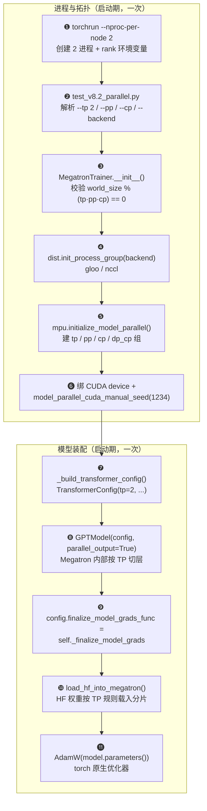
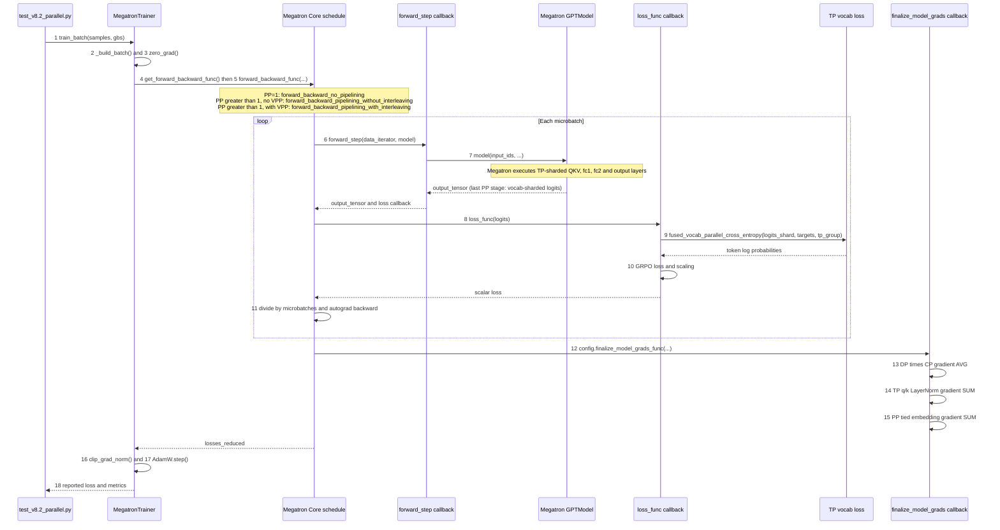
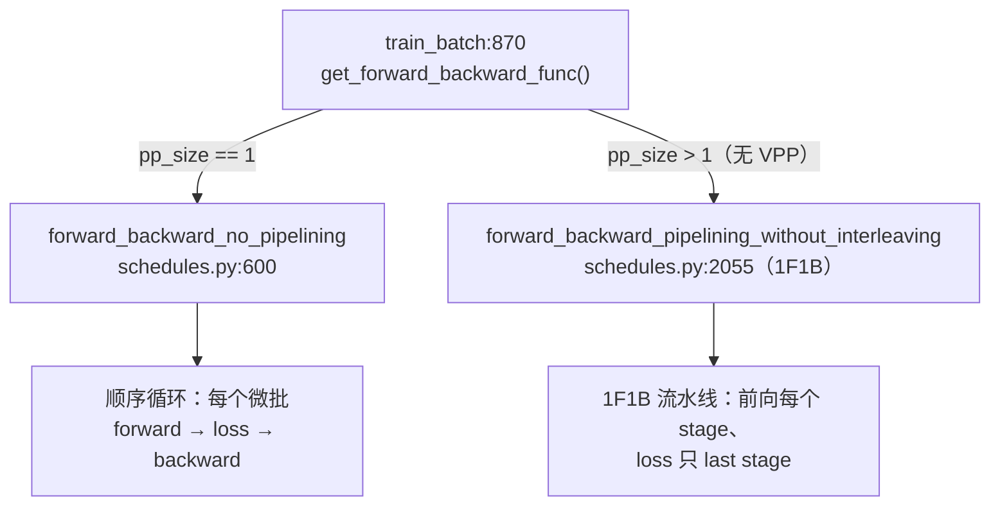
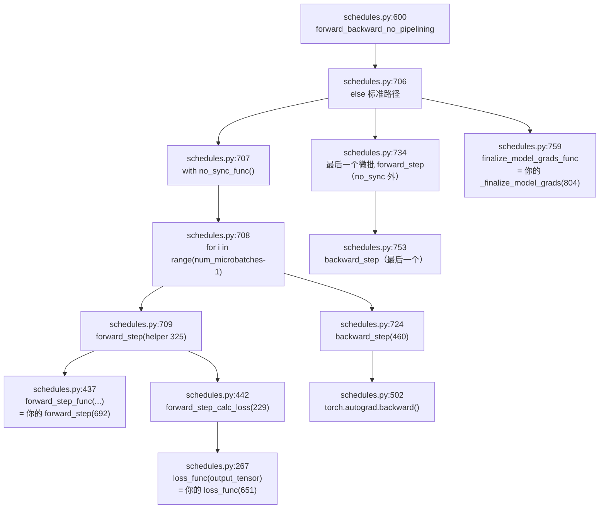

# TP：Megatron 代劳什么，调用方负责什么

本笔记回答一个容易出现的疑问：本项目开启 `--tp 2` 后，Tensor Parallel（TP）是否已经完全由 Megatron Core 实现，调用方还需要写多少代码？

结论：**层内权重切分和主通信由 Megatron Core 代劳；调用方负责并行拓扑、模型/损失接缝，以及训练系统外部的权重流转。**

本文以本仓库的[测试脚本](../../scripts/test/test_v8.2_parallel.py)调用路径为例，不进入 Megatron Core 的算子源码。

## 1. 一次 TP=2 运行的边界

```text
torchrun 创建两个进程
  -> 项目初始化 torch.distributed 和 TP process group
  -> 项目构造带 TP 配置的 Megatron GPTModel
  -> Megatron 在模型内部切分线性层并执行通信
  -> 项目提供 GRPO loss callback
  -> Megatron / PyTorch 完成反向传播
  -> 项目处理裸模型路径所需的少量梯度收尾
```

实际入口是：

```bash
torchrun --nproc-per-node 2 scripts/test/test_v8.2_parallel.py \
  --layers 4 --tp 2 --backend nccl --fp32
```

测试脚本把 `--tp` 传给 `MegatronTrainer`：

- [`scripts/test/test_v8.2_parallel.py`](../../scripts/test/test_v8.2_parallel.py#L211-L256)
- [`MegatronTrainer.__init__`](../../toy_rl/trainer/megatron_trainer.py#L205-L406)

## 1.5 TP 调用链全景（谁调谁、按什么顺序）

§1 那句「项目初始化 → 构造模型 → 前向 → 反向」太粗，缺的是**调用顺序和函数名**。这里补两张可 grep 的调用链图：图 A 是**装配阶段**（进程启动时，一次），回答「TP 系统怎么被搭起来、每个函数被谁调」；图 B 是**调用阶段**（每步训练），回答「一次 `train_batch` 里控制权如何从测试脚本流进 Megatron schedule、又流回调用方的梯度收尾」。

### 图 A：装配阶段调用链（启动期，一次）



**图解（严格按 ❶~⓫ 顺序读）**：

**❶ torchrun --nproc-per-node 2** —— `torchrun` 拉起 N 个独立进程并注入 `LOCAL_RANK`/`RANK`/`WORLD_SIZE`。它**只负责进程与 rank 环境**，不碰任何 TP 逻辑——这是 §3.1「调用方负责拓扑」的起点。

**❷ test_v8.2_parallel.py** —— argparse 把 `--tp 2`/`--pp`/`--cp`/`--backend nccl` 转成 `MegatronTrainer` 关键字参数；`--fp32` 决定 `params_dtype`（fp32 精确证明档 / bf16 舍入档）。并行配置的**唯一入口**在此收口。

**❸ MegatronTrainer.__init__()** —— 由 `--tp` 显式值或 `world_size // (pp·cp)` 推算 `tp_size`，并断言 `world_size % (tp·pp·cp) == 0`（[megatron_trainer.py:208](../../toy_rl/trainer/megatron_trainer.py#L208)）。并行度不一致在装配期就失败，而不是跑起来才炸。

**❹ dist.init_process_group(backend)** —— 初始化 torch 全局通信（[megatron_trainer.py:256](../../toy_rl/trainer/megatron_trainer.py#L256)）。注释记着踩坑：单卡多 rank 只能 gloo（NCCL 拒绝 duplicate GPU），多卡才传 nccl。

**❺ mpu.initialize_model_parallel(tp, pp, cp)** —— Megatron mpu 在这里建 TP/PP/CP/DP 组（[megatron_trainer.py:289](../../toy_rl/trainer/megatron_trainer.py#L289)）；随后 `get_tensor_model_parallel_group()` 取出组句柄、`is_pipeline_first_stage()/is_last_stage()` 判定 PP 角色。**这是「调用方负责拓扑」里最核心的一步。**

**❻ 绑 CUDA device + model_parallel_cuda_manual_seed(1234)** —— `torch.cuda.set_device(local_rank)` 让每进程绑不同卡（否则 4 进程全挤 GPU0 → OOM，NCCL 报 Duplicate GPU）；TP 随机种子保证各 TP rank dropout 种子不同、权重种子相同（不等价门会假阳性，CLAUDE.md 有教训）。

**❼ _build_transformer_config()** —— 把 HF config 映射成 `TransformerConfig`，关键是把 `tensor_model_parallel_size` 放进去（[megatron_trainer.py:143](../../toy_rl/trainer/megatron_trainer.py#L143)）。**从这里起，层内切分就归 Megatron 管了**——就是 §2 那张表。

**❽ GPTModel(config, parallel_output=True)** —— 用 TE/local layer spec（`qk_layernorm=True`）建模型；`parallel_output=True` 表示 logits 保持词表分片（[megatron_trainer.py:358](../../toy_rl/trainer/megatron_trainer.py#L358)）。PP 时 `pre_process/post_process` 按 stage 判定，只有 first stage 有 embedding、last stage 有 output layer。

**❾ config.finalize_model_grads_func = _finalize_model_grads** —— 把项目的梯度收尾钩子挂到 config 上，由 mcore schedule 在反向结束后**自动调用**（[megatron_trainer.py:376](../../toy_rl/trainer/megatron_trainer.py#L376)，对齐源 model.py:539）。源挂 mcore 原版；nano 因无 DDP wrapper 挂自己的（登记偏离）。

**❿ load_hf_into_megatron()** —— 从同一份 HF 预训练权重按 TP 规则载入分片。**对等价硬门是必需的**：TP=1 与 TP=2 是两次独立进程，随机初始化不可能一致，只有同源载入，loss/grad 等价才是在比切分本身。

**⓫ AdamW(model.parameters())** —— torch 原生优化器。没有 DDP wrapper，所以原本由 mcore DDP 做的梯度规约要由 `_finalize_model_grads` 显式补（§3.3）。

**关键直觉**：装配阶段把所有并行拓扑决策收口到 `MegatronTrainer.__init__`；「❺ 建组 + ❼❽ 放配置建模型」两步做完，调用方与 Megatron 的分工就画定了——之后层内切分和主通信不再需要调用方动手。

### 图 B：调用阶段调用链（一次 `train_batch`）

这张图改用时序图。实线箭头是调用，虚线箭头是返回；重点看 `Megatron schedule` 如何调用项目的 `forward_step` 和 `loss_func`，而不是由项目直接串起两者。



**如何把图中的两个返回标签对应回代码**：`vocab-sharded logits` 和
`logits and partial(loss_func, batch)` 都是图里的**语义标签，不是可搜索到的 Python
标识符**。实际代码是：

```python
output_tensor = self._forward_logits(batch)
return output_tensor, partial(self.loss_func, batch)
```

即 [`forward_step`](../../toy_rl/trainer/megatron_trainer.py#L692-L702) 把模型前向结果
`output_tensor` 与一个绑定了当前 `batch` 的 loss 回调一起交给 Megatron schedule。后者稍后
执行 `loss_callback(output_tensor)`，等价于 `self.loss_func(batch, output_tensor)`；并不是
在 `forward_step` 内立刻计算 loss。

`output_tensor` 的具体含义取决于 PP stage：PP=1 或最后一个 stage 时，它是 logits；由于
[`GPTModel(..., parallel_output=True)`](../../toy_rl/trainer/megatron_trainer.py#L358-L369)，TP
下每个 rank 仅持有 `[S, V/tp]` 的 vocab 分片 logits。非最后一个 PP stage 则返回 hidden
states，由 schedule 做 pipeline p2p 传输，既不调用 `loss_func`，也不进入 vocab-parallel
cross entropy。因此图中步骤 8--10 只发生在 last stage。

**图解（严格按 1~18 顺序读）**：

**1 测试脚本 → train_batch(samples, gbs)** —— 脚本用 4 条样本（含合成 `old_log_probs`）调 `train_batch`（[测试入口](../../scripts/test/test_v8.2_parallel.py#L320-L328)，[训练入口](../../toy_rl/trainer/megatron_trainer.py#L817-L911)）；PP>1 时 `microbatch_size=1`，使调度器处理多个微批。

**2 _build_batch()** —— 把样本物化成与 token 流等长的 full 数组（`targets`/`tgt_masks`/`old_log_probs`，位置 g 语义 = `logits[g]` 预测 `tokens[g+1]`），再按 `qkv_format` 走 bshd（CP 切 chunk）或 thd（packing）路径；`denom` 取**全量** loss_mask 和（CP 下 = 本 rank 部分和 / 全量分母，[megatron_trainer.py:427](../../toy_rl/trainer/megatron_trainer.py#L427)）。

**3 optimizer.zero_grad(set_to_none=True)** —— 清梯度，为梯度累积做准备（[调用处](../../toy_rl/trainer/megatron_trainer.py#L869)）。

**4 [`forward_backward_func = get_forward_backward_func()`](../../toy_rl/trainer/megatron_trainer.py#L870)** —— 这里调用 Megatron Core 的 [`get_forward_backward_func()`](../../.venv/lib/python3.13/site-packages/megatron/core/pipeline_parallel/schedules.py#L48)。**这就是 PP 的第一次分叉点**——按 `pp_size` 返回不同的调度函数，此后 PP=1 与 PP>1 走完全不同的两条路：



- **PP=1 → [`forward_backward_no_pipelining`](../../.venv/lib/python3.13/site-packages/megatron/core/pipeline_parallel/schedules.py#L600)**：单 rank 顺序循环每个微批，前向与 loss 在同一个 rank 上（内部细节见 §1.6）。
- **PP>1 → [`forward_backward_pipelining_without_interleaving`](../../.venv/lib/python3.13/site-packages/megatron/core/pipeline_parallel/schedules.py#L2055)**：非交错 1F1B 流水线，前向发生在每个 stage、loss 只在 last stage 算；中间 stage 的 `output_tensor` 是 hidden states，直接 p2p 送给下一个 stage——这正是步骤 6「前向与 loss 必须拆开」的根因。

**5 forward_backward_func()** —— 本项目的 PP>1 路径由 `forward_backward_pipelining_without_interleaving` 接管，按非交错 1F1B 时序在 stage 间 p2p 传 hidden states，并回调项目的 `forward_step`/`loss_func`（[megatron_trainer.py:867-884](../../toy_rl/trainer/megatron_trainer.py#L867-L884)）。

**6 forward_step(iter, model)** —— 每微批纯前向，返回 `(output_tensor, partial(loss_func, batch))`（[megatron_trainer.py:692](../../toy_rl/trainer/megatron_trainer.py#L692)）。这里的 `partial` 是 `functools.partial` 生成的回调：它预先绑定 `batch`，供 schedule 稍后以 `loss_callback(output_tensor)` 调用。前向与 loss 必须拆开：1F1B 里前向发生在每个 stage、算 loss 只在 last stage。

**7 _forward_logits(batch)** —— 按 `qkv_format` 选 mask 路径（thd → `packed_seq_params`；bshd+TE spec → 隐式因果；bshd+local → 显式 `[B,1,S,S]`，**True=屏蔽**与 HF 相反），调 `model(input_ids, ...)`（[megatron_trainer.py:564](../../toy_rl/trainer/megatron_trainer.py#L564)）。**从这里起进入 Megatron Core 的 TP 切分与通信**——QKV/fc1/fc2/output 层全部在这条链路里被分片执行。最后一个 PP stage 的 output layer 因 `parallel_output=True` 返回每 rank 的 `[S, V/tp]` vocab 分片 logits；中间 PP stage 返回的是要 p2p 发送的 hidden states。

**8 loss_func(batch, logits)** —— 仅 last stage 被调用；对每条样本切出 logits/targets/mask（thd 用 `local_cu_seqlens` 定位本 rank 段），逐样本算 logprob 与 loss（[megatron_trainer.py:651](../../toy_rl/trainer/megatron_trainer.py#L651)）。

**9 _vocab_parallel_log_probs()** —— 用 `fused_vocab_parallel_cross_entropy` 在 TP 组内规约 softmax 的 max/sum-exp，直接拿每 token logprob，**不 gather 全词表**（[megatron_trainer.py:597](../../toy_rl/trainer/megatron_trainer.py#L597)）。必须传独立副本：该 kernel in-place 减 max，逐样本切片共享 storage 会撞 autograd 版本计数。

**10 _grpo_sample_loss()** —— 单样本 GRPO：`ratio=exp(cur_lp-old_lp); pg=min(ratio·adv, clip(ratio,1±eps)·adv)`，loss = `-(pg·mask).sum()/denom`（[megatron_trainer.py:625](../../toy_rl/trainer/megatron_trainer.py#L625)）。随后 `loss_func` 做三因子缩放：`×num_microbatches / gbs × dp_cp_size`（[megatron_trainer.py:683](../../toy_rl/trainer/megatron_trainer.py#L683)）。

**11 loss.backward()** —— mcore schedule 在 [这里](../../.venv/lib/python3.13/site-packages/megatron/core/pipeline_parallel/schedules.py#L274) 执行 `output_tensor /= num_microbatches`，随后在 [这里](../../.venv/lib/python3.13/site-packages/megatron/core/pipeline_parallel/schedules.py#L753) 调 `backward_step()` 进入反向。前者与 `loss_func` 的 `×num_microbatches` 抵消。

**12 _finalize_model_grads()** —— 反向结束由 `config.finalize_model_grads_func` **自动调用**（图 A ❾ 挂的钩子）；三处跨 rank 梯度规约按源顺序执行（[megatron_trainer.py:804](../../toy_rl/trainer/megatron_trainer.py#L804)）。

**13 _allreduce_dp_cp_grads()** —— 全部梯度在 DP×CP 组做 **AVG**（等价 mcore DDP 的 `1/n` + all-reduce 求和，[megatron_trainer.py:783](../../toy_rl/trainer/megatron_trainer.py#L783)）。CP 下各 rank 只持有序列一部分 token，`dp_cp_size==1` 时该方法直接返回。

**14 _allreduce_qk_layernorm_grads()** —— q/k LayerNorm 梯度在 TP 组做 **SUM**（[megatron_trainer.py:726](../../toy_rl/trainer/megatron_trainer.py#L726)）。q/k-layernorm 作用在**每个头**上、头被 TP 切开，各 rank 的梯度是部分和。

**15 _allreduce_word_embedding_grads()** —— tie 的 word embedding 梯度跨 PP first/last stage 做 **SUM**（[megatron_trainer.py:751](../../toy_rl/trainer/megatron_trainer.py#L751)）。tie 意味着 first 的 `embedding` 与 last 的 `output_layer` 是同一份权重，但物理上在两个进程，各自只算到部分和。

**16 clip_grad_norm_(params, clip)** —— 在 [调用处](../../toy_rl/trainer/megatron_trainer.py#L883) 做梯度裁剪。**注意它在 finalize 之后**，clip 作用在规约完的完整梯度上——顺序错了等于裁的是部分和。

**17 optimizer.step()** —— 在 [调用处](../../toy_rl/trainer/megatron_trainer.py#L884) 执行 AdamW 更新。至此一步训练完成，三处规约全部在 step 之前就位。

**18 loss 报告** —— `losses_reduced` 只在 last stage 有值；DP/CP 先 AVG 规约还原全量，PP 再 broadcast 给所有 stage（[megatron_trainer.py:887-907](../../toy_rl/trainer/megatron_trainer.py#L887-L907)）。**纯报告用**，与梯度无关——非 last stage 报 loss=0 不是算错，是这个数在别的进程里。

**关键直觉**：调用阶段唯一的分工点是 ④——控制权交给 mcore schedule，它回调 6/8；而梯度收尾 12 是**裸模型（无 DDP wrapper）下调用方必须补的接缝**，顺序对齐源（DP/CP → qk → embedding）。

## 1.6 `forward_backward_no_pipelining` 内部（PP=1 的调度细节）

图 B 的 6~12 步把 Megatron schedule 当黑盒。这里把 PP=1 命中的 `forward_backward_no_pipelining` 拆到行号，回答「控制权进了 mcore 之后，每一步具体调了谁、回调到 nano 哪里」。

nano 无 MoE、无 hybrid CP，走的是标准 `else` 分支（[schedules.py:706](../../.venv/lib/python3.13/site-packages/megatron/core/pipeline_parallel/schedules.py#L706)）；MoE overlap 分支（[schedules.py:671](../../.venv/lib/python3.13/site-packages/megatron/core/pipeline_parallel/schedules.py#L671)）与 hybrid CP 分支（[schedules.py:687](../../.venv/lib/python3.13/site-packages/megatron/core/pipeline_parallel/schedules.py#L687)）都不命中。



**逐行跳转清单（标准路径，PP=1）**：

| # | 位置 | 做什么 |
| --- | --- | --- |
| 1 | [`schedules.py:654`](../../.venv/lib/python3.13/site-packages/megatron/core/pipeline_parallel/schedules.py#L654) | `config = get_model_config(model)`，取出 TransformerConfig |
| 2 | [`schedules.py:669`](../../.venv/lib/python3.13/site-packages/megatron/core/pipeline_parallel/schedules.py#L669) | 初始化 `total_num_tokens`（各微批 token 数累加器） |
| 3 | [`schedules.py:706`](../../.venv/lib/python3.13/site-packages/megatron/core/pipeline_parallel/schedules.py#L706) | `else:` 进入标准路径（MoE/hybrid CP 分支未命中） |
| 4 | [`schedules.py:707`](../../.venv/lib/python3.13/site-packages/megatron/core/pipeline_parallel/schedules.py#L707) | `with no_sync_func():` 包住循环（无 DDP 的 nano 是 `contextlib.nullcontext`） |
| 5 | [`schedules.py:708`](../../.venv/lib/python3.13/site-packages/megatron/core/pipeline_parallel/schedules.py#L708) | `for i in range(num_microbatches - 1)`：循环除最后一个外的所有微批 |
| 6 | [`schedules.py:709`](../../.venv/lib/python3.13/site-packages/megatron/core/pipeline_parallel/schedules.py#L709) | 调**模块级** `forward_step` helper（定义在 [`schedules.py:325`](../../.venv/lib/python3.13/site-packages/megatron/core/pipeline_parallel/schedules.py#L325)） |
| 7 | [`schedules.py:437`](../../.venv/lib/python3.13/site-packages/megatron/core/pipeline_parallel/schedules.py#L437) | helper 内部 `forward_step_func(data_iterator, model)` ← **你的 `forward_step`**（[`megatron_trainer.py:692`](../../toy_rl/trainer/megatron_trainer.py#L692)） |
| 8 | [`schedules.py:442`](../../.venv/lib/python3.13/site-packages/megatron/core/pipeline_parallel/schedules.py#L442) | helper 内部调 `forward_step_calc_loss`（定义在 [`schedules.py:229`](../../.venv/lib/python3.13/site-packages/megatron/core/pipeline_parallel/schedules.py#L229)） |
| 9 | [`schedules.py:267`](../../.venv/lib/python3.13/site-packages/megatron/core/pipeline_parallel/schedules.py#L267) | `loss_func(output_tensor)` ← **你的 `loss_func`**（[`megatron_trainer.py:651`](../../toy_rl/trainer/megatron_trainer.py#L651)） |
| 10 | [`schedules.py:722`](../../.venv/lib/python3.13/site-packages/megatron/core/pipeline_parallel/schedules.py#L722) | `total_num_tokens += num_tokens` |
| 11 | [`schedules.py:724`](../../.venv/lib/python3.13/site-packages/megatron/core/pipeline_parallel/schedules.py#L724) | 循环内 `backward_step(...)`（定义在 [`schedules.py:460`](../../.venv/lib/python3.13/site-packages/megatron/core/pipeline_parallel/schedules.py#L460)） |
| 12 | [`schedules.py:502`](../../.venv/lib/python3.13/site-packages/megatron/core/pipeline_parallel/schedules.py#L502) | `torch.autograd.backward(...)` 真正的反向 |
| 13 | [`schedules.py:731`](../../.venv/lib/python3.13/site-packages/megatron/core/pipeline_parallel/schedules.py#L731) | `del output_tensor` 释放 autograd 图头（防跨微批 graph 泄漏，见 mcore #4124） |
| 14 | [`schedules.py:734`](../../.venv/lib/python3.13/site-packages/megatron/core/pipeline_parallel/schedules.py#L734) | **最后一个微批**的 `forward_step`（在 `no_sync` **外面**，要同步梯度） |
| 15 | [`schedules.py:750`](../../.venv/lib/python3.13/site-packages/megatron/core/pipeline_parallel/schedules.py#L750) | `total_num_tokens += num_tokens` |
| 16 | [`schedules.py:753`](../../.venv/lib/python3.13/site-packages/megatron/core/pipeline_parallel/schedules.py#L753) | 最后一个微批的 `backward_step` |
| 17 | [`schedules.py:756`](../../.venv/lib/python3.13/site-packages/megatron/core/pipeline_parallel/schedules.py#L756) | `if config.finalize_model_grads_func is not None and not forward_only:` |
| 18 | [`schedules.py:759`](../../.venv/lib/python3.13/site-packages/megatron/core/pipeline_parallel/schedules.py#L759) | `config.finalize_model_grads_func(...)` ← **nano 挂的 `_finalize_model_grads`**（[`megatron_trainer.py:804`](../../toy_rl/trainer/megatron_trainer.py#L804)） |

**三个「名字相同但层级不同」的坑**：`forward_step` / `backward_step` 在 mcore 与 nano 两层各有同名函数——mcore 的模块级 helper（[`schedules.py:325`](../../.venv/lib/python3.13/site-packages/megatron/core/pipeline_parallel/schedules.py#L325) / [`schedules.py:460`](../../.venv/lib/python3.13/site-packages/megatron/core/pipeline_parallel/schedules.py#L460)）是**调度原语**；你的方法（[`megatron_trainer.py:692`](../../toy_rl/trainer/megatron_trainer.py#L692)）是被它用 `forward_step_func` 这个名字**回调**的，不是同一个函数。跳转时先认层级：325 行是 mcore 的，437 行 `forward_step_func(...)` 那一步才跳进 nano。

**两个设计细节**：
- **前 `num_microbatches-1` 个微批在 `no_sync_func()` 里、最后一个在外面**：梯度在循环内只累积、不跨 DP 同步，最后一个微批的反向才真正 all-reduce，省掉 N-1 次同步。nano 无 DDP，`no_sync_func` 退化为 `contextlib.nullcontext`（无影响），但结构仍对齐 mcore 原意。
- **每次反向后都 `del output_tensor`**：释放上一微批的 autograd 图头，否则它活到下一轮迭代才被 rebind 覆盖，触发 PyTorch 的 `AccumulateGrad node's stream does not match` 告警（mcore issue #4124）。

**关键直觉**：PP=1 时 mcore 只是把「前向 → 算 loss → 反向」按微批循环串起来，最后调一次 `finalize_model_grads_func`。前向与算 loss 都回调 nano 的 `forward_step` / `loss_func`，反向是 `torch.autograd.backward`，梯度收尾是 nano 挂的钩子——**控制权完全以回调方式流回 nano，mcore 自身不含任何 GRPO 语义**。

## 2. Megatron Core 自动完成的部分

对于 Transformer 内的主要矩阵，Megatron 已经实现了分片规则和 collective communication。调用方不应手写 `ColumnParallelLinear`、`RowParallelLinear`，也不应在 attention/MLP 内手工插入 all-reduce。

| 模块 | TP 切分方式 | 运行时结果 |
| --- | --- | --- |
| QKV 投影 | column parallel，按输出/attention head 切 | 每个 rank 得到本地 Q、K、V，并完成本地 attention |
| Attention 输出投影 | row parallel，按输入 hidden 维切 | 各 rank 算部分输出，再 SUM all-reduce 成完整 hidden state |
| MLP `fc1` / gate+up | column parallel | 各 rank 做局部 SwiGLU |
| MLP `fc2` / down projection | row parallel | 各 rank 算部分输出，再 SUM all-reduce |
| 输出词表 | vocab parallel | 每个 rank 保留部分 vocab logits，无须 gather 整个词表 |

在本项目中，只要把 `tensor_model_parallel_size` 放进 `TransformerConfig`，再构造 `GPTModel`，这些层就按 TP 方式建立：

- [`_build_transformer_config`](../../toy_rl/trainer/megatron_trainer.py#L143-L202)
- [`mpu.initialize_model_parallel`](../../toy_rl/trainer/megatron_trainer.py#L282-L305)
- [`GPTModel(..., parallel_output=True)`](../../toy_rl/trainer/megatron_trainer.py#L340-L371)

`parallel_output=True` 表示输出 logits 也保持词表分片。项目调用 Megatron 提供的 `fused_vocab_parallel_cross_entropy` 计算每 token logprob；该算子在 TP group 内规约 softmax 所需的 max 和 sum-exp，因此不会先把 logits gather 回完整词表：

- [`_vocab_parallel_log_probs`](../../toy_rl/trainer/megatron_trainer.py#L597-L623)

## 3. 调用方仍然必须负责的部分

### 3.1 进程和拓扑

`torchrun` 只负责创建进程并设置 rank 环境变量。调用方仍要：

1. 调 `dist.init_process_group()`。
2. 计算并校验 `world_size` 与 `TP x PP x CP` 的关系。
3. 调 `mpu.initialize_model_parallel()` 创建 TP/PP/CP/DP group。
4. 为每个进程绑定正确 CUDA device。

这些是“调用 Megatron”的必要部分，不是 TP 算子实现。

### 3.2 自己的训练语义

Megatron 不知道本项目的 Agentic RL 数据格式，也不知道 GRPO 的 reward、`loss_mask`、old logprob 和缩放规则。项目必须提供：

- batch 构造；
- `forward_step` callback；
- `loss_func` callback；
- optimizer 的创建和 `step()`。

PP 被启用时，项目未传 virtual pipeline 参数，故 Megatron 的 `forward_backward_pipelining_without_interleaving` 负责 stage 间通信和非交错 1F1B 时序；但它仍会回调项目的 `forward_step` 和 `loss_func`：

- [`forward_step`](../../toy_rl/trainer/megatron_trainer.py#L692-L702)
- [`train_batch` 调 Megatron schedule](../../toy_rl/trainer/megatron_trainer.py#L817-L911)

### 3.3 裸 `GPTModel + AdamW` 的梯度收尾

本项目没有套 Megatron 完整的 DDP/optimizer 训练 wrapper，而是直接使用裸 `GPTModel` 和 PyTorch `AdamW`。因此其中少量原本由完整训练栈处理的梯度收尾，需要项目显式补上。

TP 相关的一项是 q/k LayerNorm 梯度的 SUM all-reduce。q/k LayerNorm 跟 attention head 一起被 TP 切开，每张卡只算到局部梯度；必须在 TP group 中求和才能得到完整梯度：

- [`_allreduce_qk_layernorm_grads`](../../toy_rl/trainer/megatron_trainer.py#L726-L750)
- [`_finalize_model_grads`](../../toy_rl/trainer/megatron_trainer.py#L804-L813)

这不是“手写 TP attention/MLP”，而是本项目裸模型调用方式下的训练收尾。

### 3.4 TP>1 特有的两个函数调用（签名级）

下面两个函数**只在 TP>1 时才真正工作**：`tp_size<=1` 时前者退化为组大小为 1 的 all-reduce（恒等）、后者直接 `return`。它们是调用方因为「模型被 TP 切开」而必须补的两个接缝，且都显式传 `self.tp_group`——TP 通信必须限定在 TP 组内，不能误打 DP/CP 组。

**① vocab 分片 loss：`_vocab_parallel_log_probs(logits_shard, targets)`**

调用链：`loss_func` → [`_vocab_parallel_log_probs`](../../toy_rl/trainer/megatron_trainer.py#L597) → `fused_vocab_parallel_cross_entropy`：

```python
logits_shard = logits_shard.float().clone()          # 独立副本（kernel in-place 减 max）
lp = -fused_vocab_parallel_cross_entropy(
    logits_shard.unsqueeze(1).contiguous(),          # [S, 1, V/tp] 分片 logits
    targets.unsqueeze(1),                            # [S, 1]
    self.tp_group,                                   # ← TP 组句柄，kernel 内部跨组 all-reduce
)
```

关键参数是 **`self.tp_group`**：这个 fused kernel 内部跨 TP 组 all-reduce softmax 的 `max` 与 `sum-exp`，所以**不需要**先把 `[S, V/tp]` 分片 logits gather 成 `[S, V]` 全量（V=151936，gather 白白吃显存+通信）。

**② qk-layernorm 梯度规约：`_allreduce_qk_layernorm_grads()`**

调用链：`_finalize_model_grads` → [`_allreduce_qk_layernorm_grads`](../../toy_rl/trainer/megatron_trainer.py#L726) → `dist.all_reduce`：

```python
if self.tp_size <= 1 or not self.config.qk_layernorm:
    return                                            # tp=1 时直接跳过
for name, p in self.model.named_parameters():
    if p.grad is not None and ("q_layernorm" in name or "k_layernorm" in name):
        dist.all_reduce(p.grad, op=dist.ReduceOp.SUM, group=self.tp_group)  # 部分和 → 全量
```

关键参数是 **`op=SUM` + `group=self.tp_group`**：q/k-layernorm 作用在**每个头**上、头被 TP 切开，各 rank 的 `q_norm.weight`/`k_norm.weight` 梯度是**部分和**，SUM all-reduce 才是全量。其余 layernorm（`input_layernorm`/`final_layernorm`）在 TP 区域**外**（输入是各 rank 相同的全量激活），不需要这一步。

**两处的共同点**：都显式传 `self.tp_group`，而不是依赖全局默认组。这就是「TP 通信限定在 TP 组内」的工程约束——一旦误用默认组（= world group），TP=2 时会把另一个 rank 的梯度也规约进来，直接破坏等价门。

## 4. 不要和 TP 主路径混淆的代码

### 权重转换

[`megatron_to_hf.py`](../../toy_rl/trainer/megatron_to_hf.py) 里的 `all_gather_param()` 用 all-gather 把 TP 参数分片恢复为完整张量，目的是：

- 将 Megatron 训练权重导出回 Hugging Face 格式；
- 将 HF checkpoint 按 TP 规则载入 Megatron；
- 在测试中把不同并行配置的梯度恢复到同一坐标系后比较。

它不是训练前向/反向中的 TP 通信。特别是 Qwen 的 SwiGLU `linear_fc1` 必须按 gate/up 重排，不能把各分片直接拼接：

- [`all_gather_param`](../../toy_rl/trainer/megatron_to_hf.py#L67-L122)
- [`hf_to_megatron_state_dict` 的 TP 分片规则](../../toy_rl/trainer/megatron_to_hf.py#L306-L418)

### 验收代码

[`_grads_in_hf_layout`](../../scripts/test/test_v8.2_parallel.py#L111-L153) 也会对梯度做 TP gather。它只服务于“TP=2 是否与 TP=1 数值等价”的测试，并不参与真正的优化步骤。

## 5. 最小心智模型

```python
# 调用方需要知道的骨架
dist.init_process_group("nccl")
mpu.initialize_model_parallel(tensor_model_parallel_size=2)

config = TransformerConfig(tensor_model_parallel_size=2, ...)
model = GPTModel(config=config, parallel_output=True, ...).cuda()

logits_shard = model(input_ids, ...)
loss = vocab_parallel_loss(logits_shard, targets)
loss.backward()
optimizer.step()
```

其中“怎样把 `GPTModel` 内的 QKV/fc1/fc2/output layer 分片、怎样让 row-parallel 输出合并、怎样让 vocab softmax 跨卡计算”都属于 Megatron Core。

## 6. 本仓库的范围

项目调用 `initialize_model_parallel()` 时未传 EP 参数，而库源码的 `expert_model_parallel_size` 默认值为 1（[项目调用](../../toy_rl/trainer/megatron_trainer.py#L289-L293)，[库默认值](../../.venv/lib/python3.13/site-packages/megatron/core/parallel_state.py#L547-L557)）。项目构造 `TransformerConfig` 时也未传 SP 参数，而库源码的 `sequence_parallel` 默认值为 `False`（[项目配置](../../toy_rl/trainer/megatron_trainer.py#L165-L202)，[库默认值](../../.venv/lib/python3.13/site-packages/megatron/core/model_parallel_config.py#L37-L40)）。此外，`mini_slime.Trainer` 的主 Agentic RL 闭环只处理 `fake`、`torch` 和 `fsdp` 后端；`MegatronTrainer` 是独立的并行实验后端：

- [`mini_slime/args.py`](../../mini_slime/args.py#L97-L115)
- [`scripts/test/test_v8.2_parallel.py`](../../scripts/test/test_v8.2_parallel.py#L211-L328)

## 7. 建议阅读顺序

1. 本文第 1、2 节，先建立“Megatron 自动切层”的边界。
2. [测试入口](../../scripts/test/test_v8.2_parallel.py#L211-L328)，看 `--tp 2` 如何进入训练器。
3. [`MegatronTrainer.__init__`](../../toy_rl/trainer/megatron_trainer.py#L254-L405)，只看 process group、配置与建模。
4. [`MegatronTrainer.train_batch`](../../toy_rl/trainer/megatron_trainer.py#L817-L911)，理解项目何时交控制权给 Megatron schedule。
5. 再读 q/k LayerNorm 梯度规约和 HF 权重转换；它们是工程接缝，不是理解 TP 概念的前置条件。
