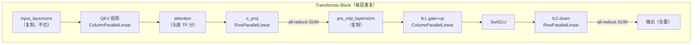

# TP>1 是怎么做的：Tensor Parallel 的切分、通信与权重流转

本笔记回答「开 `--tp 2` 之后，权重怎么被切开、前向通信发生在哪、vocab 分片 loss 怎么算、权重怎么载入/导出、梯度怎么收尾」。聚焦**机制**，不展开调度（调度见 [`megatron-schedule-internals.md`](./megatron-schedule-internals.md)）和调用方分工（见 [`tp-megatron-calling-boundary.md`](./tp-megatron-calling-boundary.md)）。

结论先行：**层内矩阵的切分与主通信由 Megatron Core 代劳（`ColumnParallelLinear` / `RowParallelLinear`）；nano 只需做三件事——把 `tensor_model_parallel_size` 放进配置、用 `fused_vocab_parallel_cross_entropy` 算 vocab 分片 loss、给 qk-layernorm 补一次跨 TP 的梯度规约。** 其余（权重切分规则、前向 all-reduce、梯度回流）全在 Megatron 内部。

## 1. TP 切什么：一张全景图

TP=2 时，一个 Transformer block 内的数据流如下（`hidden=H`，`tp=2`）：



**两句话记住 TP 的通信规律**：

1. **ColumnParallelLinear**：权重按**输出维**切（`[out/tp, in]`），输入是全量复制，各 rank 算自己的列切片 → 输出天然是分片激活，**前向不通信**。
2. **RowParallelLinear**：权重按**输入维**切（`[out, in/tp]`），输入是分片激活，各 rank 算部分和 → 输出必须 **all-reduce SUM** 还原成全量激活。

所以一个 block 里有两处 all-reduce（o_proj 后、fc2 后），其余时间各 rank 各算各的。

## 2. 切分规则的完整清单

| 层 | Megatron 并行类 | 切分维 | 前向通信 |
| --- | --- | --- | --- |
| QKV 投影 | ColumnParallelLinear | dim 0（head 维） | 无（输出分片） |
| o_proj | RowParallelLinear | dim 1（hidden 维） | all-reduce SUM |
| fc1（gate+up 融合） | ColumnParallelLinear | dim 0 | 无 |
| fc2（down） | RowParallelLinear | dim 1 | all-reduce SUM |
| word embedding | VocabParallelEmbedding | dim 0（vocab 维） | 无 |
| output_layer | ColumnParallelLinear | dim 0（vocab 维） | 无（`parallel_output=True`） |
| 各 layernorm / final_norm | 不切 | — | 各 rank 复制全量 |

对应 Megatron Core 源码：

- [`ColumnParallelLinear`](../../.venv/lib/python3.13/site-packages/megatron/core/tensor_parallel/layers.py#L770)：权重 `[output_size_per_partition, input_size]`，`set_tensor_model_parallel_attributes(..., dim=0, stride=...)`。
- [`RowParallelLinear`](../../.venv/lib/python3.13/site-packages/megatron/core/tensor_parallel/layers.py#L1134)：权重 `[output_size, input_size_per_partition]`，`set_tensor_model_parallel_attributes(..., dim=1, stride=...)`。
- [`VocabParallelEmbedding`](../../.venv/lib/python3.13/site-packages/megatron/core/tensor_parallel/layers.py#L197)：vocab 维切分。

**关键**：这些类不是 nano 手写的。只要把 `tensor_model_parallel_size` 放进 `TransformerConfig` 再建 `GPTModel`，mcore 就自动按上表建层（见 [`tp-megatron-calling-boundary.md`](./tp-megatron-calling-boundary.md) §2）。

## 3. TP 是怎么被激活的：三步

```python
# ① 配置里带上 tp_size（megatron_trainer.py:172）
TransformerConfig(tensor_model_parallel_size=tp_size, ...)

# ② 建 TP process group（megatron_trainer.py:289-290）
mpu.initialize_model_parallel(tensor_model_parallel_size=self.tp_size, ...)

# ③ parallel_output=True → 输出层也按 vocab 维切（megatron_trainer.py:367）
GPTModel(config=..., parallel_output=True, ...)
```

- **①** 让 mcore 建模型时知道「每层要按 TP 切成几份」。
- **②** 建 TP 组（rank 0/1 一组），后续所有 TP 通信都在这组里。
- **③** `parallel_output=True` 表示 output_layer 按 vocab 维切开，各 rank 只拿 `[S, V/tp]` 分片 logits，**从不 gather 成全量**（V=151936，gather 白白吃显存+通信）。

## 4. vocab 分片 logits 与 loss

因为 logits 是分片的，`log_prob` **不能**用普通 `log_softmax`（那需要全词表），必须跨 TP 组做：

- [`_vocab_parallel_log_probs`](../../toy_rl/trainer/megatron_trainer.py#L597) 调 `fused_vocab_parallel_cross_entropy`，它内部跨 `tp_group` all-reduce softmax 的 max 与 sum-exp，直接拿每 token log_prob。
- 实测（5090 TP=2）：与全量 `log_softmax` 的 `max_abs_err = 0.000e+00`，梯度正常回流。
- 注意：该 fused kernel 会 **in-place** 减 max，而 nano 是逐样本切 logits、切片共享 storage，故必须显式 `.clone()`（fp32 副证路径踩出来的坑，见函数 docstring）。

## 5. 权重载入（HF → 分片）与导出（分片 → HF）

Megatron 的参数名和形状都不是 HF 的（qkv 融合、还按 TP 切开），所以有两套转换，且**互为严格逆**：

### 5.1 载入：HF → 本 rank 的分片

[`load_hf_into_megatron`](../../toy_rl/trainer/megatron_to_hf.py#L421) → [`hf_to_megatron_state_dict`](../../toy_rl/trainer/megatron_to_hf.py#L306) → [`_tp_shard`](../../toy_rl/trainer/megatron_to_hf.py#L300)。

`_tp_shard(tensor, dim, tp_rank, tp_size)` 就是 `tensor.chunk(tp_size, dim=dim)[tp_rank]`。切分规则：

| 参数 | 切分 | 说明 |
| --- | --- | --- |
| `linear_qkv.weight` | dim 0 | qkv 融合后按 group 切（等价于按头切） |
| `linear_proj.weight`（o_proj） | dim 1 | row-parallel |
| `linear_fc1.weight` | gate、up **各自** dim 0 切再拼 `[gate_r; up_r]` | 不能整块切，否则错位 |
| `linear_fc2.weight`（down） | dim 1 | row-parallel |
| `embedding` / `output_layer` | dim 0 | vocab 维切 |

### 5.2 导出：分片 → HF 全量

[`megatron_to_hf_state_dict`](../../toy_rl/trainer/megatron_to_hf.py#L240) → [`all_gather_param`](../../toy_rl/trainer/megatron_to_hf.py#L67) → [`convert_qwen3_to_hf`](../../toy_rl/trainer/megatron_to_hf.py#L174)。

两个**最易错的点**（都写在了源码 docstring 里）：

1. **`linear_fc1` 的 GLU 重排**：Megatron 的 fc1 是 `[gate; up]` 沿 dim0 拼接后**整体**按 TP 切，rank r 手里是 `[gate_r; up_r]`。朴素 `cat` 会拼成 `[gate_0, up_0, gate_1, up_1]`（错），正确是 `[gate_0, gate_1, up_0, up_1]`。`all_gather_param` 用「各分片 `chunk(2)` 再按 gate 全体、up 全体重排」解决。
2. **`linear_qkv` 的 GQA 拆解**：融合布局是 `[num_query_groups, vpg+1(k)+1(v), head_dim, hidden]`，**不能**沿 dim0 三等分，要 `view` 成 group 维再 `split`。

载入与导出的往返（HF → Megatron → HF）是 §7 硬门的判别力来源：全程只有 reshape/split/cat/rename，无浮点运算，故 `max_abs_diff` 应**恒为 0**。

### 5.3 用形状看懂两个方向的转换（结合项目代码）

**先澄清一个概念**：权重转换只动权重矩阵的两个维度 `[out, in]`；`B`（batch）和 `S`（sequence）是**激活维度**，只在**前向**里出现，不参与权重转换本身。但用前向的激活形状能看清「out 维 = 头数 × head_dim」，这正是 qkv 要融合/拆分的原因。

以 Qwen3-0.6B 实测 config 为例（`config.json`，已核对）：

| 符号 | 值 | 含义 |
| --- | --- | --- |
| H | 1024 | hidden_size |
| n_q | 16 | 注意力头数 |
| n_kv | 8 | KV 组数（GQA） |
| d | **128** | head_dim（config 显式覆盖，**≠ H/n_q = 64**） |
| vpg | 2 | 每组 value 数 = n_q / n_kv |

注意 Qwen3 的 `head_dim=128` 覆盖了默认的 `H/heads=64`，故 qkv 输出 = 16×128 + 8×128 + 8×128 = **4096 = 4×H**（不是通常的 3×H）。[`_build_transformer_config`](../../toy_rl/trainer/megatron_trainer.py#L162) 里那句 `getattr(hf_config, "head_dim", None) or (...)` 就是抓这个覆盖。

**前向里两个形状怎么流转**：

```text
[B, S]  tokens
  │  embedding
  ▼
[B, S, H]                     H=1024
  │  @ W_qkv^T
  ▼
[B, S, 4096]                  = q(2048) + k(1024) + v(1024)
  │  切三段
  ▼
q: [B,S,2048]   k: [B,S,1024]   v: [B,S,1024]
  │  view + transpose
  ▼
[B, 16, S, 128]               = [B, n_heads, S, head_dim]
```

**关键洞察**：`W_qkv` 的 out 维（4096）是 **GQA 交错布局**——每 1 个 KV 组里，2 个 q 头紧跟它自己的 k 和 v。所以转 HF 时**不能沿 dim0 三等分**，必须先 `view` 成 `[n_kv, vpg+2, d, H]` 再 `split`。这正是 [`convert_qwen3_to_hf`](../../toy_rl/trainer/megatron_to_hf.py#L174) 里那几行的原因。

**方向 A：HF → Megatron（载入，[`hf_to_megatron_state_dict`](../../toy_rl/trainer/megatron_to_hf.py#L306)）**

```python
# qkv：3 个矩阵 view 成 4D → cat 回 1 个融合矩阵 → TP 切
q = q_proj.weight.view(n_kv, vpg, d, H)   # [2048,1024] → [8,2,128,1024]
k = k_proj.weight.view(n_kv, 1,   d, H)   # [1024,1024] → [8,1,128,1024]
v = v_proj.weight.view(n_kv, 1,   d, H)
qkv = torch.cat([q, k, v], dim=1).reshape(-1, H)   # [8,4,128,1024] → [4096,1024]
_tp_shard(qkv, 0, tp_rank, tp_size)       # 沿 out 维切 → [4096/tp, 1024]
```

**方向 B：Megatron → HF（导出，[`convert_qwen3_to_hf`](../../toy_rl/trainer/megatron_to_hf.py#L174)）**

```python
v = linear_qkv.weight.view(n_kv, -1, d, H)          # [4096,1024] → [8,4,128,1024]
q, k, val = torch.split(v, [vpg, 1, 1], dim=1)      # 按组内位置拆
q   = q.reshape(-1, H)    # → [2048,1024]
k   = k.reshape(-1, H)    # → [1024,1024]
val = val.reshape(-1, H)  # → [1024,1024]
```

注意顺序：载入是「先 cat 再 TP 切」；导出是「先 [`all_gather_param`](../../toy_rl/trainer/megatron_to_hf.py#L67) 把各 rank 分片 gather 回 `[4096,1024]` 全量，再 split」。

**fc1 的 gate/up（比 qkv 简单：chunk(2)）**

intermediate=3072，故 `gate_proj` `[3072,1024]`、`up_proj` `[3072,1024]`，融合成 `[6144,1024]`：

```python
# HF → Megatron：gate、up 各自 TP 切一半，本 rank 拼 [gate_r; up_r]
gate = _tp_shard(gate_proj.weight, 0, rank, size)   # [3072/tp, 1024]
up   = _tp_shard(up_proj.weight,   0, rank, size)
fc1  = torch.cat([gate, up], dim=0)                 # [6144/tp, 1024]

# Megatron → HF：chunk(2, dim=0)
gate, up = fc1.chunk(2, dim=0)
```

这里有个坑：**不能把 `[gate; up]` 整块 `chunk(tp)` 切**——那会得到 rank0 = 全部 gate、rank1 = 全部 up，与 Megatron 的 `stride=2` 交错布局（每 rank 持 `[gate_r; up_r]`）不符。必须 gate、up **各自**切再拼，否则导出时 `all_gather_param` 的 GLU 重排会拼错。

**TP 切分落在哪个维度（对应到激活形状）**：

| 并行类 | 切权重的哪个维 | 对应激活的哪个维 |
| --- | --- | --- |
| col-parallel（qkv/fc1/embedding/output） | dim 0（out） | `[B,S,out]` 的 out |
| row-parallel（o_proj/fc2） | dim 1（in） | `[B,S,in]` 的 in |

## 6. 梯度收尾：qk-layernorm 跨 TP

**这是 nano 裸模型（无 DDP wrapper）下必须手写的一处**：

- q/k-layernorm 作用在**每个头**上，而头被 TP 切开 → 各 rank 只见到自己那份头，算出的 `q_norm.weight` / `k_norm.weight` 梯度是**部分和**。
- [`_allreduce_qk_layernorm_grads`](../../toy_rl/trainer/megatron_trainer.py#L726) 在 TP 组内对它们做 **SUM** all-reduce。
- 其余 layernorm（`input_layernorm` / `final_layernorm`）在 TP 区域**外**，输入本就是各 rank 相同的全量激活，各 rank 已持全量梯度，**不需要**规约。

漏掉这一步的指纹（V8 实测）：**loss Δ 恰为 0，而梯度系统性偏、最差参数正是 `q_norm.weight`**。fp32 档能把 rel_L2 从 1.8e-2 打到 1.9e-5（930×），bf16 会当舍入放过。

## 7. 等价门：TP=2 与 TP=1 逐值等价

验证入口在 [`test_v8.2_parallel.py`](../../scripts/test/test_v8.2_parallel.py)：

```bash
# 基线（TP=1）
torchrun --nproc_per_node=1 scripts/test/test_v8.2_parallel.py --fp32 --dump /tmp/v82_base.pt

# G1：TP=2 与 TP=1 等价
torchrun --nproc_per_node=2 scripts/test/test_v8.2_parallel.py --fp32 --tp 2 --backend nccl \
    --dump /tmp/v82_tp2.pt --compare /tmp/v82_base.pt
```

判据（fp32 精确证明档）：`loss |Δ| < 1e-4`、grad 全局 `rel_L2 < 5e-3`、`cosine > 0.9999`。**为什么必须 fp32**：TP 切分理论上是数学恒等，fp32 下误差只剩规约顺序；bf16 的舍入会累积到几个百分点，把「切错」和「舍入」混在一起。

TP 等价的前提是两次独立进程都从**同一份 HF 权重**载入（随机初始化不可能一致），所以等价门依赖 §5.1 的载入路径。

## 8. 最小心智模型

```python
# 激活 TP：三步
config = TransformerConfig(tensor_model_parallel_size=2, ...)
mpu.initialize_model_parallel(tensor_model_parallel_size=2)
model = GPTModel(config=config, parallel_output=True, ...).cuda()

# 前向：mcore 内部自动切层 + all-reduce
logits_shard = model(input_ids)          # [S, V/tp]，分片，不 gather

# loss：跨 TP 组算 vocab 分片 cross entropy
loss = -fused_vocab_parallel_cross_entropy(logits_shard, targets, tp_group)
loss.backward()

# 收尾：qk-layernorm 梯度跨 TP 求和（头被切开）
all_reduce(q_norm.grad, op=SUM, group=tp_group); all_reduce(k_norm.grad, op=SUM)
optimizer.step()
```

**一句话总结**：TP 的切分（`ColumnParallelLinear` / `RowParallelLinear`）和主通信（row 输出 all-reduce）全在 Megatron Core 内部；nano 负责激活 TP、算 vocab 分片 loss、补 qk-layernorm 梯度规约、以及权重在 HF/Megatron 两套格式间的流转。

## 9. 建议阅读顺序

1. 先读 §1-2，建立「col 切输出、row 切输入、两处 all-reduce」的直觉。
2. 跳 mcore 源码 [`ColumnParallelLinear`](../../.venv/lib/python3.13/site-packages/megatron/core/tensor_parallel/layers.py#L770) 与 [`RowParallelLinear`](../../.venv/lib/python3.13/site-packages/megatron/core/tensor_parallel/layers.py#L1134)，看权重形状与 `set_tensor_model_parallel_attributes`。
3. 读 §5 的权重流转（[`hf_to_megatron_state_dict`](../../toy_rl/trainer/megatron_to_hf.py#L306) 与 [`all_gather_param`](../../toy_rl/trainer/megatron_to_hf.py#L67)），重点看 GLU 重排与 GQA 拆解。
4. 读 §6 的 qk-layernorm 梯度规约，理解「前向对、梯度错」的指纹。
5. 最后跑 §7 的等价门验证理解。
