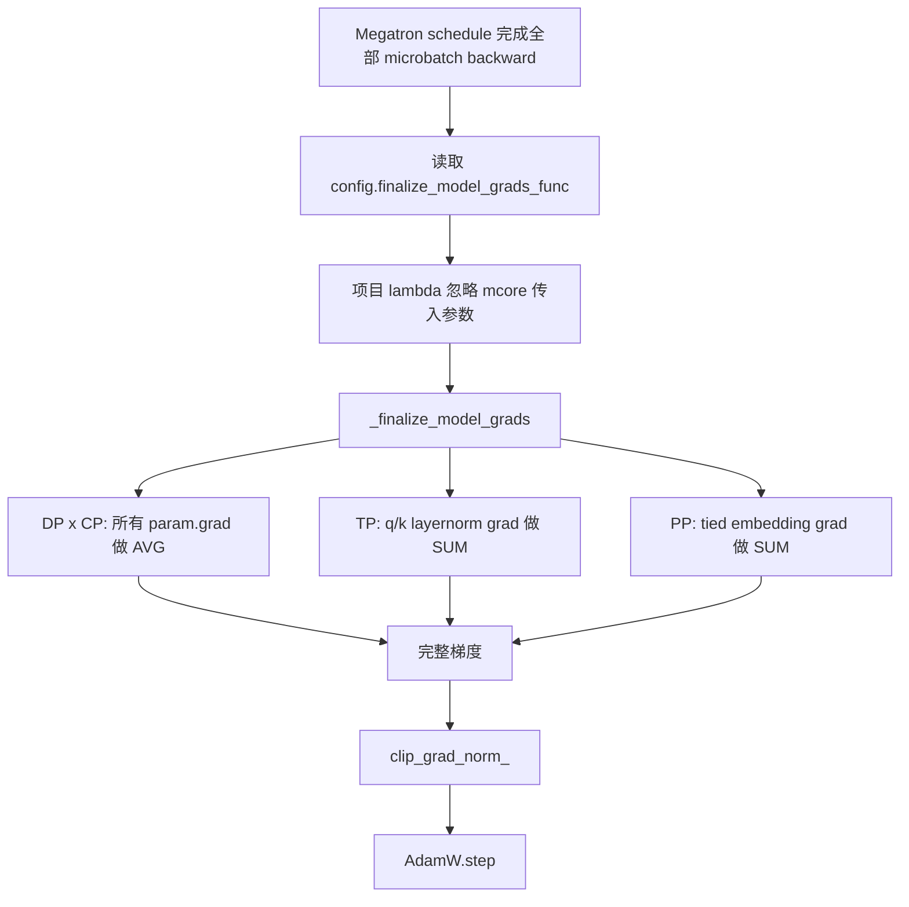

# `finalize_model_grads_func` 与三处梯度规约

## 1. 它解决什么问题

`backward()` 结束不代表每个 rank 的 `param.grad` 已经是一次全局训练步骤应使用的梯度。
并行训练把数据、序列、attention heads、模型层分散到不同 rank；某些参数的梯度因此只是一部分贡献。

必须先把缺失贡献合并，再裁剪和更新：

```text
backward
  -> 各 rank 的局部 param.grad
  -> finalize_model_grads
  -> clip_grad_norm_
  -> optimizer.step
```

如果先执行 `optimizer.step()`，不同 rank 会基于不完整或不相同的梯度更新，原本应保持一致的参数副本会发生偏离。若先裁剪，裁剪的也是局部 norm，不再等价于对完整梯度裁剪。

## 2. Megatron Core 如何触发项目 callback

项目在创建模型后写入配置：

```python
self.config.finalize_model_grads_func = (
    lambda *a, **kw: self._finalize_model_grads()
)
```

位置：[注册 callback](../../toy_rl/trainer/megatron_trainer.py#L373-L376)。

`lambda *a, **kw` 的作用不是传递参数，而是兼容 Megatron Core 的 callback 签名。Megatron Core 会传入模型列表、token 数和 process-group collection；本项目的训练器已经将模型、并行组和 group size 存在 `self` 中，因此不需要这些实参，直接调用 `self._finalize_model_grads()`。

调用路径：

```text
MegatronTrainer.train_batch
  -> get_forward_backward_func()
  -> forward_backward_func(...)
  -> Megatron Core 完成 forward / loss / backward
  -> config.finalize_model_grads_func(...)
  -> lambda
  -> MegatronTrainer._finalize_model_grads()
```

关键跳转：

- [项目将 callback 注册到 config](../../toy_rl/trainer/megatron_trainer.py#L373-L376)
- [项目调用 Megatron schedule](../../toy_rl/trainer/megatron_trainer.py#L867-L881)
- [Megatron Core 在 backward 后调用 callback](../../.venv/lib/python3.13/site-packages/megatron/core/pipeline_parallel/schedules.py#L756-L764)
- [项目的 `_finalize_model_grads`](../../toy_rl/trainer/megatron_trainer.py#L804-L813)

## 3. 三处规约总览

| 规约 | 参数范围 | 为什么局部梯度不完整 | 操作 | 目标 |
|---|---|---|---|---|
| DP x CP | 所有有梯度的参数 | 不同 DP rank 处理不同样本；不同 CP rank 处理同一序列的不同 token | `AVG` | 合并全局 batch / 序列贡献 |
| TP q/k layernorm | 名字含 `q_layernorm` 或 `k_layernorm` 的参数 | 不同 TP rank 持有不同 attention heads | `SUM` | 合并全部 heads 的贡献 |
| PP tied embedding | input embedding / output layer 的逻辑同一权重 | first stage 和 last stage 分别经过该权重的不同计算路径 | `SUM` | 合并输入端与输出端的贡献 |

项目的调用顺序：

```python
def _finalize_model_grads(self) -> None:
    self._allreduce_dp_cp_grads()
    self._allreduce_qk_layernorm_grads()
    self._allreduce_word_embedding_grads()
```

位置：[`_finalize_model_grads`](../../toy_rl/trainer/megatron_trainer.py#L804-L813)。

## 4. 第一处：DP x CP 为什么对所有梯度做 AVG

入口：[`_allreduce_dp_cp_grads`](../../toy_rl/trainer/megatron_trainer.py#L783-L802)。

```python
for p in self.model.parameters():
    if p.grad is not None:
        dist.all_reduce(p.grad, op=dist.ReduceOp.AVG, group=self.dp_cp_group)
```

DP 中，各 rank 是模型副本，但处理不同样本；CP 中，各 rank 处理同一批样本的不同 token。两种情况下，每个 rank 的梯度都是局部贡献。

它用 `AVG` 而不是 `SUM`，因为项目的 loss 已在 backward 前乘过 `dp_cp_size`：

```text
项目 loss： × dp_cp_size
梯度 AVG：  / dp_cp_size
```

两者抵消，最终恢复全局梯度。完整推导见[为什么 CP 的梯度规约用 AVG](dp-cp-gradient-average-explained.md)。

这里同步的是**数据/序列副本**的贡献，因此本质是全局 batch 梯度的合并。

## 5. 第二处：TP 的 q/k layernorm 为什么做 SUM

入口：[`_allreduce_qk_layernorm_grads`](../../toy_rl/trainer/megatron_trainer.py#L726-L751)。

TP 把 attention heads 分给不同 rank。`q_layernorm.weight` 和 `k_layernorm.weight` 虽然在每个 TP rank 上都有一份完整形状的副本，但每份副本只参与本 rank 所持 heads 的计算：

```text
TP rank 0: g_head_0 + g_head_1 + ...
TP rank 1: g_head_k + g_head_(k+1) + ...
```

同一个 layernorm 权重的正确梯度是所有 head 贡献之和：

```text
grad(q_norm.weight) = g_tp0 + g_tp1 + ...
```

所以这里必须使用 `SUM all-reduce`。若改成 AVG，就会把该梯度额外缩小 `tp_size` 倍；代码中没有对应的 `× tp_size` 预乘来抵消它。

这只针对 q/k layernorm。其他普通 layernorm 的输入和反向激活已由 TP 的 row-parallel 通信对齐，因此不需要这一额外规约。

## 6. 第三处：PP 的 tied embedding 为什么做 SUM

入口：[`_allreduce_word_embedding_grads`](../../toy_rl/trainer/megatron_trainer.py#L751-L781)。

Qwen 的输入 embedding 与输出 lm head 是 tied weight。同一逻辑权重 `W` 被用于两次：

```text
tokens -> embedding(W) -> hidden states
hidden states -> output projection(W^T) -> logits -> loss
```

因此链式法则要求：

```text
dL/dW = g_input + g_output
```

PP 大于 1 时，这两个梯度分布在不同物理副本：

```text
first stage: input embedding 路径给出 g_input
last stage:  output projection 路径给出 g_output
```

`SUM all-reduce` 恢复单卡共享参数时 PyTorch autograd 本会自动完成的梯度累加：

```text
SUM(g_input, g_output) = g_input + g_output    正确
AVG(g_input, g_output) = (g_input + g_output) / 2    错误，少一半
```

这不是重复计算。两个梯度分别来自同一个参数在输入 embedding 和输出投影中的两条不同计算图路径。

当 `PP=1` 时，这两处已经是同一个物理参数，PyTorch 会在单进程 autograd 中自动累加，函数直接返回。`tie=False` 时它们是两个不同参数，也无需合并。

## 7. 为什么这三处放在一起，顺序为何可用

三处操作都是线性的梯度加法或带固定比例的平均。它们分别沿 DP×CP、TP、PP 轴补齐贡献；即使同一个参数先经过 DP×CP 再经过 TP 或 PP，沿两个轴求和的结果相同：

```text
Σ_dp_cp Σ_tp g = Σ_tp Σ_dp_cp g
Σ_dp_cp Σ_pp g = Σ_pp Σ_dp_cp g
```

代码采用“DP/CP -> TP layernorm -> PP embedding”的顺序，是为了与 Megatron Core 的收尾顺序对应，方便对照实现；关键要求是三处都发生在 `clip_grad_norm_()` 和 `optimizer.step()` 之前。

## 8. 本命令实际执行了什么

对下面的单 worker 基线：

```bash
torchrun --nproc_per_node=1 scripts/test/test_v8.2_parallel.py --fp32 --dump /tmp/v82_base.pt
```

```text
dp_cp_size=1  -> 第一处直接返回
tp_size=1     -> 第二处直接返回
pp_size=1     -> 第三处直接返回
```

Megatron Core 仍会调用 callback；只是三处 collective 都退化为 no-op。这样同一条训练路径可用于后续 TP、PP、CP 的多卡验收。
