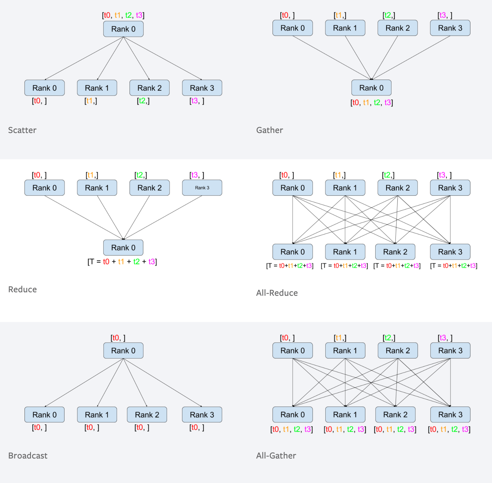

# 前置：GPU 分布式通信基础

阅读 TP、PP、CP 代码前，先建立一套共同词汇：多个 Python 进程通过通信组交换 GPU 上的
tensor。本文停在项目函数级别，不展开 NCCL、PCIe 或 Megatron-Core 的底层实现。

## 1. rank、group、root

`torchrun --nproc_per_node=4` 通常创建 4 个进程：

```text
global rank: 0, 1, 2, 3
```

每个进程通常绑定一张 GPU，但 `rank` 不必然等于物理 GPU 编号；`CUDA_VISIBLE_DEVICES` 可以重新排列可见设备。

通信只在指定 `group` 中发生。例如：

```python
tp_group = ...  # 例如 [0, 1]
pp_group = ...  # 例如 [0, 2]
```

同一个 collective 中，group 内所有 rank 必须调用同一个操作，并且调用顺序一致。一个 rank 少调用一次，其他 rank 往往会一直等待，看起来像程序卡死。

`root` 或 `src` 表示源 rank。例如 `broadcast(src=0)` 中，rank 0 的 tensor 是权威版本。

### 先记住参数的共同含义

```python
dist.some_collective(tensor, ..., group=group)
```

- `tensor`：当前 rank 参与通信的 GPU/CPU tensor。很多 collective 会**原地改写**它，所以调用后应按该操作的输出语义读取它。
- `group`：本次通信涉及的进程组。省略时使用默认 world group；传入 `tp_group`、`pp_group` 等时，只在该组内通信。
- `src`：广播或 scatter 的源 rank。
- `dst`：reduce 或 gather 的目标 rank。
- `op`：reduce/all-reduce 的逐元素运算，例如 `SUM`、`MAX`、`MIN`。
- `gather_list`：只在 gather 的目标 rank 上准备的输出列表，列表长度等于 group size，每项预分配成输入 tensor 的 shape。
- `scatter_list`：只在 scatter 的源 rank 上准备的输入列表，第 `i` 项发送给 group 中第 `i` 个 rank。

本项目使用 `src/dst` 时传的是**全局 rank**。`pp_rank`、`tp_rank` 这类编号是某个通信组内的局部 rank；如果要把它传给 `broadcast(src=...)`，应先通过该 group 的全局 rank 列表转换。NCCL 文档也特别提醒 root 参数是 rank，不是物理 GPU 编号。

## 2. 两类通信

点对点通信只有发送方和接收方，常见于 PP：

```text
stage 0 --send activation--> stage 1
stage 1 --send gradient----> stage 0
```

集体通信涉及一个 group 中的所有 rank。`reduce`、`gather`、`broadcast`、`scatter`、
`all_reduce`、`all_gather` 都属于集体通信。



图源：[Colossal-AI 分布式训练文档](https://colossalai.org/zh-Hans/docs/concepts/distributed_training/)，原图中的 `Rank` 对应本项目语境中的 process rank。

下面都假设 group 为 `[0, 1, 2, 3]`，每个 rank 有一个标量：

```text
rank 0: tensor([0])
rank 1: tensor([1])
rank 2: tensor([2])
rank 3: tensor([3])
```

## 3. `reduce` 与 `all_reduce`

### `reduce`：汇总到一个 rank

`reduce` 对各 rank 的同形状 tensor 做求和、最大值等规约，结果只保留在 `dst`：

```python
dist.reduce(x, dst=0, op=dist.ReduceOp.SUM, group=group)
```

逐参数读法：

```text
x                         当前 rank 的输入 tensor；dst rank 上会被改成规约结果
dst=0                     结果保存到全局 rank 0
op=ReduceOp.SUM           对各 rank 的 tensor 做逐元素求和
group=group               只让这个通信组参与
```

求和后只有 rank 0 得到 `tensor([6])`，其他 rank 不应读取规约后的结果。


### `all_reduce`：汇总后每个 rank 都有

```python
dist.all_reduce(x, op=dist.ReduceOp.SUM, group=group)
```

这里没有 `src` 或 `dst`，因为每个 rank 都既是输入方也是结果接收方：

```text
x                         输入和输出缓冲区，调用后每个 rank 都得到总和
op=ReduceOp.SUM           逐元素求和，也可以选择 MAX/MIN 等
group=group               只在指定通信组内规约
```

求和后所有 rank 都得到 `tensor([6])`。TP 的 row-parallel 层需要合并局部输出，DP/CP 训练后需要合并同一份权重的梯度，通常都使用它。


项目中的 CP/DP 梯度规约：

```python
for p in self.model.parameters():
    if p.grad is not None:
        dist.all_reduce(p.grad, op=dist.ReduceOp.AVG, group=self.dp_cp_group)
```

这里使用 `AVG`，因为 loss 缩放与梯度同步的平均必须配套；不能机械地把 `AVG` 换成 `SUM`。

## 4. `broadcast`：一个 rank 发给全部 rank

`broadcast` 不做数值运算，`src` 的值会覆盖 group 内所有 rank：

```python
dist.broadcast(x, src=0, group=group)
```

逐参数读法：

```text
x                         输入/输出缓冲区；src 的内容会覆盖其他 rank 的 x
src=0                     全局 rank 0 是发送源
group=group               只向该组的 rank 广播
```

调用后所有 rank 都得到 rank 0 原来的 tensor。接收方要提前准备同 shape、dtype、device 的缓冲区。


PP 权重导出正是这个模式：参数所属 stage 先 TP-gather，其他 stage 预分配缓冲区，再由 owner 广播：

```python
if owner_stage:
    full = all_gather_param(name, local_param)
else:
    full = torch.empty(shape, dtype=dtype, device=device)
dist.broadcast(full, src=owner_global_rank, group=pp_group)
```

## 5. `gather` 与 `all_gather`

### `gather`：收集到一个 rank

`gather` 不做求和，只保留每个 rank 的原始 tensor，并按 rank 顺序放进 `dst`：

```python
if rank == 0:
    output = [torch.empty_like(x) for _ in range(world_size)]
else:
    output = None
dist.gather(x, gather_list=output, dst=0, group=group)
```

逐参数读法：

```text
x                         每个 rank 要发送的本地 tensor
gather_list=output        只有 dst rank 需要提供；output[i] 是第 i 个 rank 的输入
dst=0                     只有全局 rank 0 获得完整列表
group=group               gather 的参与者和 rank 顺序由该组决定
```

只有 rank 0 得到 `[tensor([0]), tensor([1]), tensor([2]), tensor([3])]`。普通 gather 通常要求各输入形状一致；变长对象应使用 `all_gather_object` 等专门路径。

这里的 `dist.gather` 是**跨进程通信**；不要与 `torch.gather` 混淆。后者只是在单个 tensor 内按 index 取值，不会让 GPU 之间传数据。


### `all_gather`：所有 rank 都得到完整列表

```python
parts = [torch.empty_like(x) for _ in range(world_size)]
dist.all_gather(parts, x, group=group)
```

逐参数读法：

```text
parts                     当前 rank 的输出列表，调用后每个 rank 都填满
x                         当前 rank 提供的本地 tensor
group=group               parts 按 group rank 顺序保存所有输入
```

每个 rank 都得到完整列表。TP 权重恢复使用这个模式：


```python
partitions = [torch.empty_like(param.data) for _ in range(tp_size)]
dist.all_gather(partitions, param.data.contiguous(), group=tp_group)
full = torch.cat(partitions, dim=partition_dim)
```

`linear_fc1` 是例外：GLU 分片不能直接 `cat`，要先拆 gate/up 再重排，详见主教程。

## 6. `scatter`：一个 rank 分发不同 tensor

`scatter` 是 `gather` 的反向形态：只有 `src` 准备完整列表，每个 rank 收到其中一项：

```python
if rank == 0:
    inputs = [torch.tensor([10], device=device),
              torch.tensor([20], device=device),
              torch.tensor([30], device=device),
              torch.tensor([40], device=device)]
else:
    inputs = None

out = torch.empty(1, device=device)
dist.scatter(out, scatter_list=inputs, src=0, group=group)
```

逐参数读法：

```text
out                       每个 rank 的接收缓冲区，调用后得到一项
scatter_list=inputs       只有 src rank 准备；inputs[i] 发给 group 中第 i 个 rank
src=0                     全局 rank 0 负责分发
group=group               决定参与者和 scatter_list 的 rank 顺序
```

结果是 rank 0/1/2/3 分别得到 10/20/30/40。Megatron 的 PP 激活传递通常是点对点 send/recv，不要因为“把数据分给多个 stage”就自动选择 `scatter`。

同理，`dist.scatter` 是跨进程分发；`tensor.scatter_()` 是单个 tensor 内的索引写入，两者不是一回事。


## 7. 六种操作对照

| 操作 | 数值规约 | 结果在哪些 rank | 结果形态 | 典型用途 |
|---|---|---|---|---|
| `reduce` | 是 | 只有 `dst` | 一个汇总 tensor | 只需主 rank 的统计值 |
| `all_reduce` | 是 | 所有 rank | 每个 rank 一个相同汇总 tensor | TP 激活、DP/CP 梯度 |
| `broadcast` | 否 | 所有 rank | 每个 rank 一份 src tensor | PP 参数广播 |
| `gather` | 否 | 只有 `dst` | `dst` 得到 rank 顺序列表 | 主 rank 收集定长 tensor |
| `all_gather` | 否 | 所有 rank | 每个 rank 得到完整列表 | TP 参数恢复 |
| `scatter` | 否 | 所有 rank | 每个 rank 得到一项 | root 分发定长 tensor |

两个常见扩展：`reduce_scatter` 是“先规约再分片”，适合不想让每卡保存完整结果；`all_to_all` 是每个 rank 向每个其他 rank 发送不同分片，复杂 token/专家路由会使用它。`barrier()` 只同步进度，不搬运 tensor。

## 通信开销怎么算

先定义三个量：

```text
P = group 中的 rank 数
N = 每个 rank 的输入元素数量
b = 每个元素的字节数（fp32=4，bf16/fp16=2）
S = N x b       # 每个 rank 输入 tensor 的大小
```

下面的“总网络流量”按所有 rank 的**发送字节数之和**计算，每条网络传输只计一次；接收端收到的字节数与它相同。实际 NCCL 会根据拓扑选择 ring、tree 或分层算法，因此这是理解量级的估算，不是某个版本的精确 kernel 计数。

对 `all_gather` 要特别注意：每个 rank 输入的是一片 `S`，最终完整 tensor 的大小是 `P x S`；这与 TP 参数 gather 的语义一致。

### 4 个 rank、1 GiB tensor 的估算

令 `P=4`、`S=1 GiB`：

| 操作 | 理想总网络流量 | 单 rank 典型发送/接收量 | 瓶颈 |
|---|---:|---:|---|
| `reduce` | `(P-1)S = 3 GiB` | root 约收 3 GiB；其他 rank 各发 1 GiB | root |
| `broadcast` | `(P-1)S = 3 GiB` | root 约发 3 GiB；其他 rank 各收 1 GiB | root |
| `gather` | `(P-1)S = 3 GiB` | root 约收 3 GiB；其他 rank 各发 1 GiB | root |
| `scatter` | `(P-1)S = 3 GiB` | root 约发 3 GiB；其他 rank 各收 1 GiB | root |
| `all_gather` | `P(P-1)S = 12 GiB` | 每 rank 约发/收 `(P-1)S = 3 GiB`，最终得到 4 GiB | 全组链路 |
| `all_reduce` | `2(P-1)S = 6 GiB` | 每 rank 约发/收 `2((P-1)/P)S = 1.5 GiB` | 全组链路 |

对于 `P=4` 的 all-reduce，每个 rank 的 1 GiB tensor 会分成 4 个约 256 MiB 的 chunk；reduce-scatter 和 all-gather 各经过 3 轮，因此每个 rank 发送约 `6 x 256 MiB = 1.5 GiB`。all-gather 的输入则是每 rank 1 GiB shard，最终每 rank 得到 4 GiB 完整 tensor，所以每 rank 需要转发约 `3 x 1 GiB = 3 GiB`。

### 把 `all_reduce` 手算一遍

假设有 4 个 rank，每个 rank 初始都有一个完整的 1 GiB tensor：

```text
rank 0: [a0, a1, a2, a3]
rank 1: [b0, b1, b2, b3]
rank 2: [c0, c1, c2, c3]
rank 3: [d0, d1, d2, d3]
```

把每个 tensor 切成 4 个 chunk，所以每个 chunk 是 `1 GiB / 4 = 256 MiB`。

**阶段一：reduce-scatter**

每个 rank 只负责最终结果的一个 chunk。经过 3 轮交换与相加后：

```text
rank 0: a0 + b0 + c0 + d0
rank 1: a1 + b1 + c1 + d1
rank 2: a2 + b2 + c2 + d2
rank 3: a3 + b3 + c3 + d3
```

每个 rank 在这个阶段发送 3 个 chunk：

```text
3 x 256 MiB = 768 MiB = 0.75 GiB
```

**阶段二：all-gather**

现在每个 rank 只有总和的一个 chunk，再经过 3 轮把其他 rank 的结果 chunk 传过来：

```text
每个 rank 再发送 3 x 256 MiB = 0.75 GiB
```

两阶段相加：

```text
每个 rank 发送 = 0.75 GiB + 0.75 GiB = 1.5 GiB
4 个 rank 的总发送量 = 4 x 1.5 GiB = 6 GiB
```

这里的“总发送量 6 GiB”只统计网络发送方向，每一段数据在网络上只计一次。因为每个发送者同时也会接收同样多的数据，所以如果把“发送 + 接收”都相加，会得到 `6 + 6 = 12 GiB`；这不是另一种算法，只是统计口径不同。

朴素的“先 reduce 到 rank 0，再 broadcast”也需要约 `3 GiB + 3 GiB = 6 GiB` 的总发送量，但所有压力集中在 root。ring all-reduce 把 1.5 GiB 的发送量均匀分摊给每个 rank，更适合 GPU 集群。

### 时间模型

常用的粗略模型是：

```text
通信时间 T ≈ α x 轮数 + β x 单 rank 通信字节数
```

其中 `α` 是一次通信启动延迟，`β` 是单位字节传输时间（带宽的倒数）。所以：

- 小 tensor 主要受 `α` 和通信轮数影响。
- 大 tensor 主要受 `β` 和有效带宽影响。
- root-only 操作的总字节数未必比 all-gather 大，但 root 会成为热点。
- `all_reduce` 既有规约计算，又要让所有 rank 得到完整结果，通常是训练中最昂贵的 collective 之一。

### 对当前项目的对应关系

| 项目代码路径 | 通信 | 为什么发生 |
|---|---|---|
| TP row-parallel 前向 | `all_reduce` | 各 TP rank 的局部矩阵乘结果要相加。 |
| `_vocab_parallel_log_probs()` | TP 内部规约 | 每张卡只有 `V/TP` 词表 logits，但 softmax 需要全局统计量。 |
| `all_gather_param()` | `all_gather` | 把 TP 参数分片恢复为完整 Megatron 参数。 |
| PP 权重导出 | `broadcast` | 参数 owner stage 将完整参数发给其他 stage。 |
| `_allreduce_dp_cp_grads()` | `all_reduce` | DP/CP rank 对同一权重的局部梯度需要合并。 |
| `_allreduce_qk_layernorm_grads()` | TP `all_reduce` | 各 rank 只拥有部分 Q/K head 的 layernorm 梯度。 |
| PP 训练调度 | `send/recv` | stage 间传递 activation 和反向梯度，不是 gather/scatter。 |

因此文档前面所说“高频 TP 通信应留在同一 NUMA 节点”，主要针对反复发生的 activation/gradient all-reduce；一次性的 PP 权重 broadcast 通常不是同等级别的性能热点。

一个和本项目直接对应的例子：`TP=2` 时，若完整权重是 1 GiB，则每个 rank 的 shard 是 0.5 GiB。

```text
all_gather_param:
  每 rank 发送/接收约 0.5 GiB
  全组发送总量约 1 GiB
  每 rank 最终得到完整的 1 GiB 权重

TP all-reduce（假设每 rank 都有 1 GiB 的完整形状梯度）：
  每 rank 发送/接收约 1 GiB
  全组发送总量约 2 GiB
  每 rank 最终得到规约后的 1 GiB 梯度
```

## 可运行示例：4 个 rank 的实际数据流

演示脚本是 [`scripts/collective_ops_demo.py`](../../scripts/collective_ops_demo.py)。它为 rank 0、1、2、3 分别准备 `1、2、3、4`，并依次执行六种操作。CPU 环境使用 `gloo`：

```bash
torchrun --standalone --nproc_per_node=4 \
    scripts/collective_ops_demo.py --backend gloo --device cpu
```

有 4 张 GPU 时使用 NCCL：

```bash
torchrun --standalone --nproc_per_node=4 \
    scripts/collective_ops_demo.py --backend nccl --device cuda
```

示例输出如下。脚本只让 rank 0 打印最终汇总，避免 4 个进程重复刷屏；`all_reduce` 和 `all_gather` 的输出表示每个 rank 都获得相同结果。

```text
reduce(sum, dst=0): rank0=10
broadcast(src=0): all_ranks=100
gather(dst=0): rank0=[1, 2, 3, 4]
scatter(src=0): all_ranks_receive=[10, 20, 30, 40]
all_reduce(sum): all_ranks=10
all_gather: all_ranks=[1, 2, 3, 4]
```

逐行对应：

| 输出 | 解释 |
|---|---|
| `rank0=10` | 只有 root 看到 `1+2+3+4`。 |
| `all_ranks=100` | rank 0 的 `100` 覆盖其他 rank。 |
| `[1, 2, 3, 4]` | gather 保留每个 rank 的原始值，只交给 rank 0。 |
| `10, 20, 30, 40` | scatter 由 rank 0 分发不同值，每个 rank 收到一项。 |
| `all_ranks=10` | all-reduce 求和，并把总和返回所有 rank。 |
| `all_ranks=[1, 2, 3, 4]` | all-gather 收集但不求和，并把完整列表返回所有 rank。 |

## 8. 你的 GPU 拓扑输出

你提供的是：

```text
        GPU0    GPU1    GPU2    GPU3    CPU Affinity    NUMA Affinity
GPU0     X      NODE    SYS     SYS     0-19,40-59      0
GPU1    NODE     X      SYS     SYS     0-19,40-59      0
GPU2    SYS     SYS      X      NODE    20-39,60-79     1
GPU3    SYS     SYS     NODE     X      20-39,60-79     1
```

直接读出：

```text
NUMA node 0: GPU0, GPU1
NUMA node 1: GPU2, GPU3
```

- GPU0 与 GPU1 是 `NODE`：同一 NUMA 本地域，路径较近。
- GPU2 与 GPU3 同理，属于 NUMA node 1。
- GPU0/1 与 GPU2/3 是 `SYS`：跨 CPU socket 或 NUMA 域，延迟通常更高。
- `CPU Affinity` 表示 GPU 关联的 CPU 核范围；GPU0/1 关联 `0-19,40-59`，GPU2/3 关联 `20-39,60-79`。
- `GPU NUMA ID: N/A` 不代表没有 NUMA；当前应以 `NUMA Affinity` 和 `CPU Affinity` 为准。

所以这台机器上，`TP=2` 优先使用：

```text
[GPU0, GPU1] 或 [GPU2, GPU3]
```

而不是高通信量的 `[GPU0, GPU2]`。

可以用这些命令复核：

```bash
nvidia-smi topo -m
numactl -H
echo "$CUDA_VISIBLE_DEVICES"
nvidia-smi -L
```

最后两项用于确认物理 GPU 编号和进程的可见设备顺序没有被 `CUDA_VISIBLE_DEVICES` 重排。

## 9. `--topology` 的作用

`--topology` 是验证开关，不会自动绑定 GPU，也不会改变 rank 映射。它先打印实际通信组：

```python
groups = trainer.parallel_group_ranks()
```

然后根据这台机器的硬件假设检查 TP group 是否在同一 NUMA node：

```python
numa = {0: 0, 1: 0, 2: 1, 3: 1}
tp_ranks = groups["tp"]
check(len({numa.get(r, -1) for r in tp_ranks}) == 1, ...)
```

它验证的是性能拓扑，不是数学正确性：

- TP 每层频繁 all-reduce，通信量大，优先放同 NUMA。
- PP 每个 stage 边界传 activation/gradient，频率相对低，跨 NUMA 通常更能接受。
- 换服务器、换 `CUDA_VISIBLE_DEVICES` 或换 rank order 后，必须重新读取 `nvidia-smi topo -m`，不能盲目复用上面的 NUMA 字典。

## 10. 读分布式代码的五个问题

1. tensor 现在在哪个 group 的哪个 rank 上？
2. 这次是求和（reduce），还是收集/复制（gather/broadcast）？
3. 结果只有一个 rank 有，还是所有 rank 都有？
4. 输入 shape 是否必须一致？是否需要 root 准备列表？
5. 这是 TP、PP、CP 还是 DP×CP 语义下的通信？

回答这五个问题后，再阅读主教程中的 TP、PP、CP 和权重转换，就能把每个 collective 与它解决的数学问题对应起来。

## 参考资料与图示取舍

- [NVIDIA NCCL Collective Operations](https://docs.nvidia.com/deeplearning/nccl/user-guide/docs/usage/collectives.html)：每个 collective 单独配图，适合作为操作语义的权威参照；其中也特别提醒 `root` 是 rank，不是物理 GPU 编号。
- [PyTorch: Writing Distributed Applications](https://docs.pytorch.org/tutorials/intermediate/dist_tuto.html)：用简短代码并列展示 Scatter、Gather、Reduce、All-Reduce、Broadcast、All-Gather，适合作为 API 级入门材料。
- [NVIDIA Technical Blog: Fast Multi-GPU Collectives with NCCL](https://developer.nvidia.com/blog/fast-multi-gpu-collectives-nccl/)：说明 ring/tree 选择、PCIe 拓扑和通信带宽之间的关系。

本项目后续若重新制作本地图片，建议沿用这些资料的三个设计原则：每个操作独立成图；输入与输出使用固定的 rank lane；在图旁明确标注“结果只在 root”还是“所有 rank 都有”，不要依赖颜色或箭头方向让读者猜语义。官方图片仅作为语义和版式参考，不直接复制到仓库。
