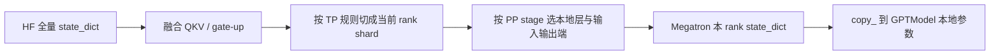

# HF 到 Megatron：权重载入与 TP 分片

本文记录 [`hf_to_megatron_state_dict`](../toy_rl/trainer/megatron_to_hf.py) 的职责：
把一份**完整的 Hugging Face（HF）Qwen3 checkpoint**转换为某个 Megatron rank 所需的
**本地参数分片**。对应的逐值验证是
[`scripts/test_v8.1_megatron_to_hf.py`](../scripts/test_v8.1_megatron_to_hf.py)。

## 1. 为什么不能直接 `load_state_dict`

HF 与 Megatron 对同一个 Qwen3 模型保存参数的方式不同：

| 方面 | HF | Megatron |
|---|---|---|
| Q、K、V | `q_proj`、`k_proj`、`v_proj` 三个独立张量 | 一个融合的 `linear_qkv.weight` |
| SwiGLU MLP 第一层 | `gate_proj`、`up_proj` 两个独立张量 | 一个融合的 `linear_fc1.weight` |
| TP=2 参数存储 | 每个进程读取完整张量 | 每个 TP rank 只保存本地 shard |
| PP=2 层号 | 全局层号 | 每个 stage 从局部 `decoder.layers.0` 开始编号 |

因此下面这种写法不会正确工作：

```python
model.load_state_dict(hf_state)
```

正确的数据流是：



这个映射只包含 reshape、split、concat、切片与改名，不应进行浮点计算。因此其反向转换
`Megatron -> HF` 与这里必须严格互逆，往返的最大绝对误差应为：

$$
\max |W_{HF} - \operatorname{toHF}(\operatorname{toMegatron}(W_{HF}))| = 0
$$

## 2. 入口与输出

函数的简化签名是：

```python
hf_to_megatron_state_dict(
    hf_state,
    hf_config,
    num_layers,
    tp_rank,
    tp_size,
    tie,
    layer_offset=0,
    include_embedding=True,
    include_final_norm=True,
    include_output_layer=None,
)
```

返回的不是完整 Megatron checkpoint，而是一个只包含**当前 rank 应持有参数**的字典。随后
[`load_hf_into_megatron`](../toy_rl/trainer/megatron_to_hf.py) 将它逐项复制到
`model.named_parameters()`。

例如在 `TP=2` 下，rank 0 与 rank 1 都返回：

```text
decoder.layers.0.self_attention.linear_qkv.weight
```

但它们对应的张量值是不同的半片，且每片的形状小于 HF 完整权重。这个返回结构必须与当前
`GPTModel` 已经按 TP/PP 构造出的本地参数名和形状完全一致。

## 3. TP 分片规则

辅助函数 `_tp_shard(tensor, dim, tp_rank, tp_size)` 沿指定维度均匀切分，并返回当前 rank 的
那一块：

```python
tensor.chunk(tp_size, dim=dim)[tp_rank].contiguous()
```

两类线性层的切分维度不同：

| 参数 | Megatron 层类型 | 切分维度 | 直觉 |
|---|---|---:|---|
| embedding / output layer | vocab-parallel | 0 | 每个 rank 管一段词表行 |
| `linear_qkv` | column-parallel | 0 | 每个 rank 计算一部分输出特征/attention heads |
| `linear_fc1` | column-parallel | 0 | 每个 rank 计算一部分 FFN 中间通道 |
| `linear_proj` (`o_proj`) | row-parallel | 1 | 输入通道已经由 TP rank 分片 |
| `linear_fc2` (`down_proj`) | row-parallel | 1 | 输入 FFN 通道已经由 TP rank 分片 |

如果将 row-parallel 层误切 `dim=0`，形状可能仍可被某些配置接受，但前向的局部矩阵乘法与
all-reduce 语义会错误。因此 V8.0 不只比较 loss，也要比较 gather 回 HF 布局后的梯度。

## 4. QKV 融合：必须按 GQA 的 KV group 排列

HF 将 attention 权重分开保存：

```text
q_proj.weight
k_proj.weight
v_proj.weight
```

Megatron 需要一个 `linear_qkv.weight`。对于普通多头注意力，容易误以为只要简单拼成：

```text
[all Q heads; all K heads; all V heads]
```

但 Qwen3 使用 GQA。每个 KV group 对应多个 Q heads，Megatron 的融合顺序是：

```text
group 0: [Q heads for group 0; K0; V0]
group 1: [Q heads for group 1; K1; V1]
...
```

代码因此先 reshape：

```python
q = q_proj.view(num_query_groups, value_num_per_group, head_dim, hidden_size)
k = k_proj.view(num_query_groups, 1, head_dim, hidden_size)
v = v_proj.view(num_query_groups, 1, head_dim, hidden_size)
qkv = torch.cat([q, k, v], dim=1).reshape(-1, hidden_size)
```

然后再沿 `dim=0` 分给各 TP rank。这样每个 rank 获得完整的一组或多组 GQA head，而不会把
Q 与其对应的 K/V 打散。

反向导出时 [`convert_qwen3_to_hf`](../toy_rl/trainer/megatron_to_hf.py) 使用相反的
`view -> split -> reshape` 操作恢复三个 HF 权重。

## 5. SwiGLU：先切 gate/up，再在本地拼接

HF 的 MLP 第一层有两个权重：

```text
gate_proj.weight
up_proj.weight
```

Megatron 用一个融合后的 `linear_fc1.weight` 表示它们。设 `TP=2`，正确的本地布局是：

```text
rank 0: [gate_0; up_0]
rank 1: [gate_1; up_1]
```

所以实现是：

```python
gate = _tp_shard(gate_proj, dim=0, tp_rank=tp_rank, tp_size=tp_size)
up = _tp_shard(up_proj, dim=0, tp_rank=tp_rank, tp_size=tp_size)
linear_fc1 = torch.cat([gate, up], dim=0)
```

不要先把完整张量拼成 `[gate; up]` 再整体切分。那会得到不符合 Megatron 分区语义的块，导出时
也无法正确恢复 gate/up。这个规则与 [`all_gather_param`](../toy_rl/trainer/megatron_to_hf.py)
中对 `linear_fc1` 的 GLU 重排严格互逆。

## 6. Vocab padding、tie 与 PP 输入输出端

### Vocab padding

Megatron 的词表大小在某些配置下会补齐为 TP 可整除的行数。载入时 `_pad_vocab()` 在 HF
embedding 或 lm head 后追加零行；导出回 HF 时 `remove_padding()` 再删除这些行。

Qwen3-0.6B 的词表大小恰好适配当前配置，因此这通常是 no-op，但保留逻辑可以防止换模型或
换 TP 尺寸后悄悄错位。

### Tied embedding 与 output layer

`tie_word_embeddings=True` 表示 HF 的 `lm_head.weight` 与 `embed_tokens.weight` 是同一逻辑权重。
在 PP=1 时，Megatron 的 first stage 通常不单独持有 output layer；因此默认：

```python
include_output_layer = not tie
```

但 PP>1 时，last stage 的 `pre_process=False`，Megatron 会实际创建 `output_layer.weight`。
它在模型构建时可能为零，等待 embedding-group 同步；本项目在模型建成后才加载 HF 权重，故必须
显式把 embedding 对应的 TP shard 写入该 output layer。否则不会立刻形状报错，但 logits 可能退化、
loss 与梯度都会错误。

### PP 层与端点选择

PP 把层按 stage 纵向分布：

| 参数类型 | 应在哪个 PP stage 载入 |
|---|---|
| embedding | first stage |
| transformer layers | 持有该局部层的 stage |
| final norm / output layer | last stage |

参数 `include_embedding`、`include_final_norm`、`include_output_layer` 应以已创建模型的真实参数表为准。
`load_hf_into_megatron()` 正是通过 `model.named_parameters()` 判断它们，而不是仅依赖对
`pre_process`、`post_process` 的猜测。

## 7. 局部层号与全局层号

PP>1 时，每个 stage 的本地层号从 0 开始。举例：一个四层模型按 PP=2 切分后：

```text
stage 0: decoder.layers.0, decoder.layers.1  -> HF model.layers.0, model.layers.1
stage 1: decoder.layers.0, decoder.layers.1  -> HF model.layers.2, model.layers.3
```

因此转换时必须用 `layer_offset`：

```python
hf_layer_name = f"model.layers.{local_index + layer_offset}"
```

offset 来自 Megatron 的 `get_transformer_layer_offset(model.config)`。载入与导出必须使用同一套
offset；只修一端会造成“每个 stage 都有合法形状，但层被错配”的静默错误。

## 8. 验证与调试

V8.1 的验证链路是：

```text
HF checkpoint
  -> hf_to_megatron_state_dict
  -> load_hf_into_megatron
  -> megatron_to_hf_state_dict
  -> 与原始 HF checkpoint 逐值比较
```

关键硬门：

```text
max_abs_diff == 0
参数名集合完全一致
gate_proj / up_proj 与原始张量逐值相等
转换后的权重能被 HF 模型载入并产生 finite logits
```

运行方式：

```bash
# TP=1：不切分基线
torchrun --nproc_per_node=1 scripts/test_v8.1_megatron_to_hf.py

# TP=2：验证 split / gather 与 GLU 重排
torchrun --nproc_per_node=2 scripts/test_v8.1_megatron_to_hf.py
```

若 `max_abs_diff` 非零，先根据最差参数名定位：

| 最差参数或现象 | 优先检查 |
|---|---|
| `q_proj` / `k_proj` / `v_proj` | GQA group 内 QKV 融合顺序、head_dim、`num_query_groups` |
| `gate_proj` / `up_proj` | 是否“分别切再拼”，以及 gather 时是否做 GLU 重排 |
| `o_proj` / `down_proj` | 是否沿 `dim=1` row-parallel 切分 |
| `embed_tokens` / `lm_head` | vocab padding、TP vocab shard、tie 与 PP last-stage output layer |
| 层号重复或缺层 | `layer_offset` 是否同时用于载入和导出 |

这份转换逻辑是 Megatron 后端连接训练与 SGLang/HF 推理权重的必要桥梁：训练时使用分片的
Megatron 参数，发布或同步时将它们恢复为推理引擎可消费的 HF state_dict。