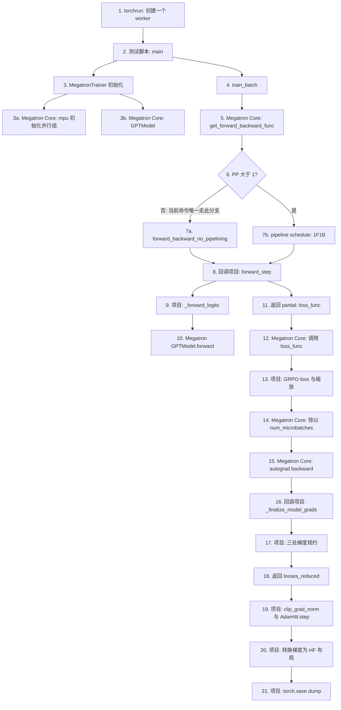

# Megatron Core 调用链

本文解释下面这条命令中，Megatron Core 在哪里进入、在哪里回调项目代码，以及 loss 缩放与梯度规约分别由谁完成。

```bash
torchrun --nproc_per_node=1 scripts/test/test_v8.2_parallel.py --fp32 --dump /tmp/v82_base.pt
```

## 图的阅读顺序与分支选择

按节点编号从 `1` 读到 `21`。节点 `6` 是唯一的 schedule 分支；它不表示“先尝试 7a，失败再走 7b”，而是 Megatron 根据 `PP` 配置**只返回其中一个**函数。

当前命令的优先执行路径是：

```text
1 -> 2 -> 3 -> 4 -> 5 -> 6 -- PP=1 --> 7a
-> 8 -> 9 -> 10 -> 11 -> 12 -> 13 -> 14 -> 15
-> 16 -> 17 -> 18 -> 19 -> 20 -> 21
```

也就是说，这条单 worker 基线不会走 `7b` 的 pipeline 1F1B 分支。只有命令传入 `--pp 2` 或更大值时，节点 `6` 才会选择 `7b`；之后两条分支在节点 `8` 汇合，都是由 Megatron schedule 回调项目的 `forward_step`。

## 1. 先看实际配置

本命令只有一个 worker，因此：

```text
world_size=1
TP=1, PP=1, CP=1, DP=1
global batch size=4
microbatch size=4
num_microbatches=1
```

最后一项来自测试脚本：PP 为 1 时，`micro` 直接取整个 batch 的 `gbs`。

- [构造 4 条样本](../../scripts/test/test_v8.2_parallel.py#L86-L108)
- [`gbs` 与 `micro` 的计算](../../scripts/test/test_v8.2_parallel.py#L323-L328)
- [`num_microbatches = len(chunks)`](../../toy_rl/trainer/megatron_trainer.py#L836-L837)

因此，Megatron Core 的 `output_tensor /= num_microbatches` 在本命令中确实会走到，但实际是 `/ 1`，数值不变。它在 PP 大于 1 或调用方使用较小 `microbatch_size` 时才会真正产生缩放效果。

## 2. 项目第一次进入 Megatron Core：初始化与建模

测试脚本从 [`main()`](../../scripts/test/test_v8.2_parallel.py#L211-L256) 创建训练器：

```python
trainer = MegatronTrainer(...)
```

训练器内部第一次使用 Megatron Core 的位置如下：

```text
MegatronTrainer.__init__
  -> dist.init_process_group
  -> megatron.core.mpu.initialize_model_parallel
  -> megatron.core.models.gpt.GPTModel
```

跳转入口：

- [`dist.init_process_group()`](../../toy_rl/trainer/megatron_trainer.py#L254-L256)
- [`mpu.initialize_model_parallel()`](../../toy_rl/trainer/megatron_trainer.py#L286-L293)
- [导入 Megatron Core 的 `GPTModel`](../../toy_rl/trainer/megatron_trainer.py#L345-L345)
- [创建 `GPTModel` 并搬到 CUDA](../../toy_rl/trainer/megatron_trainer.py#L357-L371)

这里的 `self.model` 已经是 `megatron.core.models.gpt.GPTModel`，不是项目自己定义的 PyTorch 模型。

## 3. 训练时真正进入 Megatron schedule 的位置

最容易漏掉的入口在 [`MegatronTrainer.train_batch()`](../../toy_rl/trainer/megatron_trainer.py#L817-L911)：

```python
from megatron.core.pipeline_parallel.schedules import get_forward_backward_func

forward_backward_func = get_forward_backward_func()
losses_reduced = forward_backward_func(
    forward_step_func=self.forward_step,
    data_iterator=iter(batches),
    model=[self.model],
    num_microbatches=len(batches),
    ...
)
```

直接跳转：

- [导入 schedule 并取得函数](../../toy_rl/trainer/megatron_trainer.py#L867-L870)
- [调用 `forward_backward_func`](../../toy_rl/trainer/megatron_trainer.py#L871-L881)
- [Megatron Core：按 PP 大小选择 schedule](../../.venv/lib/python3.13/site-packages/megatron/core/pipeline_parallel/schedules.py#L143-L154)

当前命令的 `PP=1`，因此 `get_forward_backward_func()` 返回安装包中的 [`forward_backward_no_pipelining`](../../.venv/lib/python3.13/site-packages/megatron/core/pipeline_parallel/schedules.py#L600-L784)，而不是 1F1B pipeline schedule。

换言之，下面这行不是普通函数调用，而是把控制权交给 Megatron：

```python
forward_backward_func(...)
```

## 4. Megatron 如何回调本项目的前向和 loss

项目把 `self.forward_step` 作为 callback 传入 schedule。Megatron Core 在 [`schedules.py:437`](../../.venv/lib/python3.13/site-packages/megatron/core/pipeline_parallel/schedules.py#L437) 调它：

```python
output_tensor, loss_func = forward_step_func(data_iterator, model)
```

因此真实调用关系是：

```text
Megatron Core forward_step(...)
  -> 项目 MegatronTrainer.forward_step(...)
       -> 项目 _forward_logits(...)
            -> Megatron GPTModel.forward(...)
       -> 返回 partial(项目 loss_func, batch)
```

对应跳转：

- [项目的 `forward_step`](../../toy_rl/trainer/megatron_trainer.py#L692-L702)
- [项目的 `_forward_logits`](../../toy_rl/trainer/megatron_trainer.py#L564-L595)
- [`self.model(...)`，即 Megatron `GPTModel.forward`](../../toy_rl/trainer/megatron_trainer.py#L593-L595)
- [`partial(self.loss_func, batch)` 的返回](../../toy_rl/trainer/megatron_trainer.py#L700-L702)

注意：`loss_func` 在 `forward_step()` 内没有立刻执行。项目只是把它作为闭包返回，稍后由 Megatron schedule 调用。

## 5. loss 的 `num_microbatches` 除法在哪里

Megatron Core 取得闭包后，在 [`forward_step_calc_loss`](../../.venv/lib/python3.13/site-packages/megatron/core/pipeline_parallel/schedules.py#L229-L305) 中执行：

```text
Megatron Core
  -> loss_func(output_tensor)             # 调用项目 loss_func
  -> output_tensor /= num_microbatches    # 安装包中的除法
  -> backward_step(...)
```

关键跳转：

- [Megatron 调用 `loss_func(output_tensor)`](../../.venv/lib/python3.13/site-packages/megatron/core/pipeline_parallel/schedules.py#L267-L274)
- [`output_tensor /= num_microbatches`](../../.venv/lib/python3.13/site-packages/megatron/core/pipeline_parallel/schedules.py#L274)
- [项目的 `loss_func`](../../toy_rl/trainer/megatron_trainer.py#L651-L690)
- [项目显式乘 `num_microbatches / global_batch_size * dp_cp_size`](../../toy_rl/trainer/megatron_trainer.py#L682-L683)

所以缩放分散在两个模块：

```text
项目 loss_func：        × num_microbatches / global_batch_size × dp_cp_size
Megatron Core schedule：/ num_microbatches
```

令 `M = num_microbatches`、`G = global_batch_size`、`N = dp_cp_size`，并令
`L[r, m]` 表示 rank `r` 的第 `m` 个 microbatch 在进入 `loss_func()` 前的局部 loss。对每个 microbatch，实际进入 backward 的 loss 是：

```text
L[r, m]
  × M / G × N             # 项目 loss_func
  / M                     # Megatron schedule
= L[r, m] × N / G
```

因此你的理解是对的：**`M` 在 schedule 的除法处被完全抵消**。在这一刻，剩下的确实只有：

```text
× dp_cp_size / global_batch_size
```

注意项目的 `loss_func()` 返回的第二项是 `torch.tensor(1)`，所以 schedule 在 `:273` 的
`/ num_tokens` 对本项目也是 `/ 1`，不改变数值。

再往后，当前 rank 会累积全部 `M` 个 microbatch 的梯度；反向 callback 中的梯度 AVG 才消去 `N`：

```text
当前 rank 累积梯度： N / G × Σ_m grad(L[r, m])

DP x CP AVG：
AVG_r(N / G × Σ_m grad(L[r, m]))
= 1 / G × Σ_r Σ_m grad(L[r, m])
```

所以**最终用于 `optimizer.step()` 的梯度**只保留 `/ global_batch_size`（以及单样本 GRPO loss 内部的 token 分母）；`num_microbatches` 和 `dp_cp_size` 都已经分别被 schedule 与梯度 AVG 抵消。

对本命令，`M=1`、`N=1`、`G=4`：所有并行/累积缩放都退化，最终就是四条样本的 GRPO 梯度之和再除以 4。

## 6. backward 和项目梯度 callback

loss 被 Megatron Core 缩放后，schedule 通过 [`backward_step`](../../.venv/lib/python3.13/site-packages/megatron/core/pipeline_parallel/schedules.py#L752-L753) 进入反向；其内部调用 [`torch.autograd.backward`](../../.venv/lib/python3.13/site-packages/megatron/core/pipeline_parallel/schedules.py#L564-L589)。

反向循环结束后，Megatron Core 读取模型配置上的 callback：

```python
config.finalize_model_grads_func(...)
```

调用点在 [`schedules.py:756-764`](../../.venv/lib/python3.13/site-packages/megatron/core/pipeline_parallel/schedules.py#L756-L764)。项目在初始化时注册的是：

```python
self.config.finalize_model_grads_func = (
    lambda *a, **kw: self._finalize_model_grads()
)
```

- [项目注册 callback](../../toy_rl/trainer/megatron_trainer.py#L373-L376)
- [项目的 `_finalize_model_grads`](../../toy_rl/trainer/megatron_trainer.py#L804-L813)
- [DP x CP 梯度 AVG all-reduce](../../toy_rl/trainer/megatron_trainer.py#L783-L802)

三种规约分别补齐什么梯度、为何 DP x CP 用 AVG 而 TP/PP 用 SUM，见
[`finalize_model_grads_func` 与三处梯度规约](finalize-model-grads-explained.md)。

这也解释了为什么在 `train_batch()` 里看不到直接写出的 `self._finalize_model_grads()`：它是 Megatron schedule 在反向结束后回调的。

对于当前单 worker 命令，`dp_cp_size=1`，所以 DP x CP 的 AVG 函数会在条件判断后立即返回；但 callback 路径仍然完整存在。

## 7. schedule 返回后，控制权回到项目

`forward_backward_func(...)` 返回 `losses_reduced` 后，代码回到项目的 `train_batch()`：

```text
项目 train_batch
  -> clip_grad_norm_
  -> AdamW.step
  -> 汇总报告用 loss
  -> return metrics
```

- [梯度裁剪与参数更新](../../toy_rl/trainer/megatron_trainer.py#L883-L884)
- [报告用 loss 的 DP x CP AVG](../../toy_rl/trainer/megatron_trainer.py#L886-L893)
- [返回 metrics](../../toy_rl/trainer/megatron_trainer.py#L906-L911)

这里的 `dist.all_reduce(t, AVG, ...)` 只处理 `t = [loss_sum, trained]` 的**日志指标**；真实参数梯度的同步已经在第 6 节的 `_allreduce_dp_cp_grads()` callback 中完成。两者都使用 AVG，但对象和时机不同。

## 8. 训练后的梯度快照

测试脚本拿到 `metrics` 后，调用 [`_grads_in_hf_layout`](../../scripts/test/test_v8.2_parallel.py#L111-L153)，把 Megatron 参数布局中的 `param.grad` 转成 HF 名称和布局：

```text
param.grad
  -> all_gather_param
  -> remove_padding
  -> convert_qwen3_to_hf
  -> CPU float32 clone
  -> torch.save('/tmp/v82_base.pt')
```

- [梯度收集和转换调用](../../scripts/test/test_v8.2_parallel.py#L124-L142)
- [`all_gather_param`](../../toy_rl/trainer/megatron_to_hf.py#L67-L122)
- [`convert_qwen3_to_hf`](../../toy_rl/trainer/megatron_to_hf.py#L174-L237)
- [保存基线 dump](../../scripts/test/test_v8.2_parallel.py#L356-L369)

`--dump` 不会触发比较；后续另一条带 `--compare` 的命令才会读回这个文件并运行 `_compare()`。
