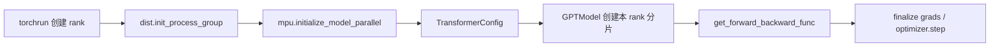

# Megatron Core 常用 API：本项目的调用方式

本文不是 Megatron-LM 的完整手册，而是解释本项目的
[`MegatronTrainer`](../toy_rl/trainer/megatron_trainer.py) 实际调用的 `megatron.core` API。
目标是能沿着一次训练步骤回答三个问题：

1. 当前进程属于哪个 TP / PP / CP 组？
2. 当前 rank 持有哪些参数、处理哪些张量？
3. 前向、反向和跨 rank 梯度规约分别由谁执行？

对应的可运行入口：

- TP 等价验证：[`scripts/test_v8.0_megatron_tp.py`](../scripts/test_v8.0_megatron_tp.py)
- 权重转换验证：[`scripts/test_v8.1_megatron_to_hf.py`](../scripts/test_v8.1_megatron_to_hf.py)
- TP x PP x CP 验证：[`scripts/test_v8.2_parallel.py`](../scripts/test_v8.2_parallel.py)

## 1. 先分清三层 API

Megatron Core 不负责拉起进程。一次运行有三层职责：

| 层 | 典型 API | 职责 |
|---|---|---|
| 进程层 | `torchrun`、`torch.distributed` | 启动 rank、建立世界通信组、为每个进程提供 `RANK` 和 `LOCAL_RANK` |
| 拓扑层 | `megatron.core.mpu` | 把 world group 切成 TP / PP / CP / DP 等子组 |
| 模型与调度层 | `TransformerConfig`、`GPTModel`、pipeline schedule | 按子组构造分片模型，并以正确的通信顺序执行训练 |

最常见的误解是把 `torchrun --nproc_per_node=2` 当成“TP=2”。它只表示启动两个进程；TP、PP、CP 如何分解由随后传给 `mpu.initialize_model_parallel()` 的配置决定：

$$
\text{world\_size} = TP \times PP \times CP \times DP
$$

例如 `world_size=4, TP=2, PP=2, CP=1` 时，DP 为 1；同样的四个进程若配置为 `TP=1, PP=1, CP=1`，则 DP 为 4。



## 2. 进程组与 `mpu`

### `dist.init_process_group`

这是 PyTorch API，不是 Megatron API：

```python
import torch.distributed as dist

dist.init_process_group(backend="nccl")
rank = dist.get_rank()
world_size = dist.get_world_size()
```

它建立包含所有 rank 的 **world group**。多卡 GPU 训练通常用 `nccl`；本项目的单卡双 rank TP 验证必须用 `gloo`，因为 NCCL 不允许两个 rank 绑定同一物理 GPU。

在 [`MegatronTrainer.__init__`](../toy_rl/trainer/megatron_trainer.py) 中，先完成这一步，才调用任何 `mpu` API。每个进程还必须绑定正确设备：多卡时 `LOCAL_RANK` 对应可见设备索引；单卡多 rank 的验证场景则让两个进程都回退到可见的第 0 张卡。

### `mpu.initialize_model_parallel`

`mpu` 是 `megatron.core` 的 model-parallel utilities 模块。它根据 world group 创建和缓存各类子组：

```python
from megatron.core import mpu

mpu.initialize_model_parallel(
    tensor_model_parallel_size=tp_size,
    pipeline_model_parallel_size=pp_size,
    context_parallel_size=cp_size,
)
```

本项目在 [`MegatronTrainer.__init__`](../toy_rl/trainer/megatron_trainer.py) 中只在
`not mpu.model_parallel_is_initialized()` 时调用它。原因是 `mpu` 持有进程级全局状态：同一进程内不能随意以另一套尺寸重复初始化。

初始化后的常用查询如下：

| API | 含义 | 本项目用途 |
|---|---|---|
| `mpu.get_tensor_model_parallel_rank()` | 当前 rank 在 TP 组中的编号 | 日志、HF 权重切片 |
| `mpu.get_tensor_model_parallel_group()` | 当前 TP 通信组 | vocab-parallel cross entropy、qk layernorm 梯度规约 |
| `mpu.get_pipeline_model_parallel_rank()` | 当前 PP stage 编号 | 日志、stage 行为判断 |
| `mpu.get_pipeline_model_parallel_group()` | 当前 PP 通信组 | PP loss 广播、验收汇总 |
| `mpu.get_context_parallel_rank()` | 当前 CP 分片编号 | 日志与 CP 调试 |
| `mpu.get_context_parallel_group()` | 当前 CP 通信组 | 拓扑观察 |
| `mpu.get_data_parallel_world_size()` | DP 大小 | 训练规模信息 |
| `mpu.get_data_parallel_group(with_context_parallel=True)` | DP 和 CP 合并后的梯度同步组 | CP/DP 梯度规约 |
| `mpu.is_pipeline_first_stage()` | 是否 PP 第一段 | 决定是否构造 embedding |
| `mpu.is_pipeline_last_stage()` | 是否 PP 最后一段 | 决定是否构造 output layer 与计算 loss |

不要按全局 `rank` 猜 TP/PP 角色。组的 rank 布局由 Megatron 的初始化规则决定；需要检查时使用项目中的 `parallel_group_ranks()`，它会从 `ProcessGroup` 读取真实成员。

### `model_parallel_cuda_manual_seed`

```python
from megatron.core.tensor_parallel.random import model_parallel_cuda_manual_seed

model_parallel_cuda_manual_seed(1234)
```

这个 API 为模型并行建立专用 RNG 状态。它不是普通的 `torch.manual_seed()` 替代品：Megatron 会让需要一致的部分一致，也允许 TP 内应独立的随机操作拥有不同状态。

本项目显式把 `hidden_dropout` 与 `attention_dropout` 都设为 0。否则 TP=1 与 TP=2 的等价测试会因为不同 TP rank 的 dropout RNG 而失去可比性，这不是切分公式本身的错误。

## 3. 用 `TransformerConfig` 描述模型与并行拓扑

`TransformerConfig` 是模型构造时的单一配置对象。它既描述 Qwen3 的结构，也描述 Megatron 如何并行：

```python
from megatron.core.transformer.transformer_config import TransformerConfig

config = TransformerConfig(
    num_layers=hf_config.num_hidden_layers,
    hidden_size=hf_config.hidden_size,
    num_attention_heads=hf_config.num_attention_heads,
    num_query_groups=hf_config.num_key_value_heads,
    ffn_hidden_size=hf_config.intermediate_size,
    kv_channels=head_dim,
    tensor_model_parallel_size=tp_size,
    pipeline_model_parallel_size=pp_size,
    context_parallel_size=cp_size,
    params_dtype=torch.bfloat16,
    pipeline_dtype=torch.bfloat16,
    gated_linear_unit=True,
    normalization="RMSNorm",
    qk_layernorm=True,
)
```

项目把 HF config 映射到它的逻辑集中在
[`_build_transformer_config`](../toy_rl/trainer/megatron_trainer.py)。常用字段的语义：

| 字段 | 意义 | 常见错误 |
|---|---|---|
| `tensor_model_parallel_size` | 层内按行/列分片的 TP 大小 | 只启动多个进程却没设这个字段，模型不会按预期 TP 切分 |
| `pipeline_model_parallel_size` | 按层切成多少 PP stage | 忘记设置 `pipeline_dtype`，PP 的 p2p 缓冲无法按正确 dtype 分配 |
| `context_parallel_size` | 按序列维切分的 CP 大小 | 以为它等于 sequence packing；CP 与 THD packing 可组合，但不是同一概念 |
| `num_query_groups` | GQA 的 KV group 数 | 把 QKV 当成三个等大的块拆分，会错误处理 GQA |
| `params_dtype` | 参数及主要计算精度 | fp32 可用于等价证明；实际训练通常为 bf16 |
| `attention_backend` | TE attention 后端请求 | 不要手工设置 `NVTE_*` 环境变量，应由 config 驱动 Megatron/TE 设置 |
| `variable_seq_lengths` | PP 下微批序列长是否动态变化 | THD packing + PP 时需要开启 |

配置应在 `mpu.initialize_model_parallel()` 之后、`GPTModel` 之前构建。前者决定 rank 的拓扑，后者读取 config 并据此产生本 rank 的分片模块。

## 4. `GPTModel`：创建的就是本 rank 的模型分片

本项目的模型构造核心如下：

```python
from megatron.core.models.gpt import GPTModel
from megatron.core.models.gpt.gpt_layer_specs import get_gpt_layer_local_spec

model = GPTModel(
    config=config,
    transformer_layer_spec=get_gpt_layer_local_spec(qk_layernorm=True),
    vocab_size=hf_config.vocab_size,
    max_sequence_length=hf_config.max_position_embeddings,
    pre_process=mpu.is_pipeline_first_stage(),
    post_process=mpu.is_pipeline_last_stage(),
    position_embedding_type="rope",
    parallel_output=True,
    share_embeddings_and_output_weights=True,
)
```

`GPTModel` 不会先创建完整模型再切开。在 TP/PP 已初始化时，它直接创建当前 rank 应持有的局部参数：

- **TP**：`ColumnParallelLinear` 按输出维切；`RowParallelLinear` 按输入维切；embedding 与输出词表也可按 vocab 维切。
- **PP**：第一 stage 才有 embedding，最后 stage 才有 final norm 与 output layer，中间 stage 只保存自己负责的 transformer layers。
- **CP**：模型参数通常不因 CP 而额外切开，但每个 rank 前向时只接收序列的一部分。

所以 `model.named_parameters()` 返回的是本 rank 的本地 shard。V8.0 的
[`_shard_stats`](../scripts/test_v8.0_megatron_tp.py) 正是在观察这些局部形状；要恢复完整权重则需要 TP gather，再转换为 HF 布局。

### `transformer_layer_spec`

layer spec 选择每层的组件实现：

```python
from megatron.core.models.gpt.gpt_layer_specs import (
    get_gpt_layer_local_spec,
    get_gpt_layer_with_transformer_engine_spec,
)
```

本项目的约定：TP-only 的基础路径可用 local spec；CP 必须使用 TransformerEngine spec。二者的数学目标相同，但模块命名和 attention 后端能力不同，不能把某一套 spec 的参数名硬编码为另一套。

### `parallel_output=True`

这个参数非常重要：它让输出层保留分片 logits，而不是在每次前向时 gather 成完整词表：

```text
每个 TP rank 的 logits: [S, V / TP]
而非完整 logits:          [S, V]
```

好处是避免为大词表做昂贵的 gather；代价是下游不能直接 `torch.log_softmax(logits, -1)`。必须使用 vocab-parallel 的 loss API，见下一节。

## 5. vocab-parallel loss：不要先 gather logits

```python
from megatron.core.fusions.fused_cross_entropy import (
    fused_vocab_parallel_cross_entropy,
)

token_loss = fused_vocab_parallel_cross_entropy(
    logits_shard.unsqueeze(1).contiguous(),  # [S, 1, V / TP]
    targets.unsqueeze(1),                    # [S, 1]
    tp_group,
)
log_probs = -token_loss
```

`fused_vocab_parallel_cross_entropy` 接收每个 TP rank 的 logits shard 和完整 target id，内部在 `tp_group` 上规约 max 与 sum-exp。返回值与“先 gather 完整词表 logits，再做 cross entropy”的数学结果相同，但不会物化完整词表维度。

本项目在 [`_vocab_parallel_log_probs`](../toy_rl/trainer/megatron_trainer.py) 中使用它来构造 GRPO 所需的 `cur_log_prob`。

注意两点：

1. 传入的最后一个参数必须是 **TP group**，不是 world group、PP group 或 DP group。
2. 该融合 kernel 会原地改写传入 logits。项目对 `logits_shard.float().clone()` 后再调用，避免逐样本切片共享 storage 时破坏 autograd 版本计数。

## 6. PP 训练：`forward_step` 与 `get_forward_backward_func`

### `forward_step` 的签名

Megatron pipeline schedule 需要一个约定的回调：

```python
def forward_step(data_iterator, model):
    batch = next(data_iterator)
    output_tensor = model(...)
    return output_tensor, loss_func
```

其中 `loss_func(output_tensor)` 返回：

```python
(loss, num_tokens, metrics_dict)
```

本项目对应实现是 [`MegatronTrainer.forward_step`](../toy_rl/trainer/megatron_trainer.py)。前向和 loss 必须拆开：PP 中间 stage 只产生 hidden states 并发送给下一 stage；只有最后 stage 的输出是 logits，只有它能计算语言模型/GRPO loss。

### `get_forward_backward_func`

```python
from megatron.core.pipeline_parallel.schedules import get_forward_backward_func

forward_backward_func = get_forward_backward_func()
losses_reduced = forward_backward_func(
    forward_step_func=trainer.forward_step,
    data_iterator=iter(batches),
    model=[trainer.model],
    num_microbatches=len(batches),
    seq_length=global_sequence_length,
    micro_batch_size=microbatch_size,
    forward_only=False,
)
```

它根据当前 PP 配置自动选择调度：PP=1 时是不经 pipeline 的普通前反向；PP>1 时是 1F1B 的 warmup、steady、cooldown 调度。warmup 先做若干次前向以填满流水线，steady 阶段前向与反向交替执行，cooldown 阶段停止接收新的前向任务并完成剩余反向。不要在业务代码里手写 `send/recv` 来替代它，否则很容易在微批数、激活生命周期或反向顺序上死锁：各 stage 必须严格匹配微批数量、激活值产生与释放时机，以及前向和反向通信顺序；任一发送或接收次序不一致，都可能导致设备互相等待。

本项目的 [`train_batch`](../toy_rl/trainer/megatron_trainer.py) 是标准使用位置。V8.0 的 `_microbatch_backward()` 只为单微批 TP 验收保留；它明确禁止 PP>1。

`losses_reduced` 只有 PP last stage 会有真实 loss。项目为了让所有 rank 都能报告同一个数字，额外将 last stage 的结果 broadcast 回 PP group；这一步只服务日志，不参与梯度计算。

## 7. packing 与 `PackedSeqParams`

THD packing 把多个不同长度样本沿 token 维拼成扁平流，边界由累积长度描述：

```python
from megatron.core.packed_seq_params import PackedSeqParams

packed = PackedSeqParams(
    cu_seqlens_q=cu_seqlens,
    cu_seqlens_kv=cu_seqlens,
    max_seqlen_q=max_seqlen,
    max_seqlen_kv=max_seqlen,
    qkv_format="thd",
)

logits = model(
    input_ids=flat_tokens,
    position_ids=None,
    attention_mask=None,
    packed_seq_params=packed,
)
```

`PackedSeqParams` 告诉 TE/attention kernel 每个样本的边界，因此 `attention_mask=None` 并不表示样本可以互相注意；在正确的 varlen 后端中，`cu_seqlens` 正是隔离信息来源。

它与 CP 的关系是：每个 CP rank 只持有序列的两段对称 chunk，但 `cu_seqlens` 仍必须描述**全局**段边界。项目通过 [`cp_utils.py`](../toy_rl/trainer/cp_utils.py) 的切分规则保持二者一致。

## 8. 反向结束后：`finalize_model_grads_func`

Megatron schedule 在反向结束后会检查 `config.finalize_model_grads_func`。项目将它挂为：

```python
config.finalize_model_grads_func = lambda *args, **kwargs: (
    trainer._finalize_model_grads()
)
```

这是一个“反向已结束、clip 与 optimizer step 尚未开始”的钩子。它适合处理局部反向不能自动完成的跨组梯度规约：

| 梯度 | 通信组 | 为什么要规约 |
|---|---|---|
| q/k layernorm | TP group，SUM | 每个 rank 只看到自己那部分 attention heads |
| tied embedding / output layer | embedding PP group，SUM | PP first 与 last stage 对同一逻辑权重各自得到部分梯度 |
| 普通参数的 DP/CP 梯度 | DP x CP group，AVG | 不同 rank 持有不同样本或 token 段，梯度需要合并 |

源项目依赖 Megatron DDP 的 `main_grad` 缓冲完成其中一部分；本项目使用裸 `GPTModel` 与 PyTorch `AdamW`，因此按相同语义对 `param.grad` 做了显式规约。不要在 `optimizer.step()` 后才做这类规约，届时各 rank 已经沿不同梯度更新，参数会分叉。

## 9. 一次训练步骤的最小骨架

下面把本项目的关键 API 按正确顺序压缩在一起。省略了 HF 权重转换、真实数据集和错误处理：

```python
# 每个 torchrun rank 都执行。
dist.init_process_group(backend="nccl")
mpu.initialize_model_parallel(
    tensor_model_parallel_size=tp,
    pipeline_model_parallel_size=pp,
    context_parallel_size=cp,
)

config = TransformerConfig(
    tensor_model_parallel_size=tp,
    pipeline_model_parallel_size=pp,
    context_parallel_size=cp,
    # 其余模型结构字段必须和 checkpoint 对齐。
)
model = GPTModel(
    config=config,
    transformer_layer_spec=layer_spec,
    pre_process=mpu.is_pipeline_first_stage(),
    post_process=mpu.is_pipeline_last_stage(),
    parallel_output=True,
)

config.finalize_model_grads_func = finalize_grads
optimizer.zero_grad(set_to_none=True)
get_forward_backward_func()(
    forward_step_func=forward_step,
    data_iterator=iterator,
    model=[model],
    num_microbatches=num_microbatches,
    seq_length=global_seq_length,
    micro_batch_size=micro_batch_size,
    forward_only=False,
)
torch.nn.utils.clip_grad_norm_(model.parameters(), max_norm)
optimizer.step()
```

其中 `forward_step` 的 loss 路径必须针对 `parallel_output=True` 使用
`fused_vocab_parallel_cross_entropy`，而不是聚合 logits 后套常规交叉熵。

## 10. 调试清单

| 现象 | 先检查什么 |
|---|---|
| `world_size` 不能整除模型并行大小 | 检查 $TP \times PP \times CP$ 与 `torchrun` rank 数 |
| TP=2 但参数形状没有缩小 | `mpu.initialize_model_parallel()` 是否早于 `GPTModel`；`TransformerConfig.tensor_model_parallel_size` 是否为 2 |
| TP loss 对、gradient 不等价 | qk-layernorm 的 TP SUM-all-reduce 是否在 step 前发生 |
| PP 时 rank 0 的 loss 是 0 | rank 0 可能是 first stage；loss 只在 last stage 产生 |
| `parallel_output=True` 后 log-prob 报错或结果不对 | 是否错误使用普通 `log_softmax`；应传 TP group 给 fused vocab-parallel CE |
| CP 开启后结果错或后端报错 | 是否用了 TE spec、flash 后端、正确的两段对称切分与全局 `cu_seqlens` |
| 单卡双 rank NCCL 失败 | 这是预期限制；改用 gloo 仅验证语义，性能测量必须用多卡 NCCL |
| 编译/运行都没错但权重导出错 | 检查 TP gather、GLU gate/up 重排、GQA QKV 拆分，以及 PP stage 间的权重广播 |

对于“能跑但不确定是否正确”的情况，优先执行 V8.0 或 V8.2 的 fp32 等价门。TP/PP 的正确实现应在 loss、全局梯度 relative L2 和 cosine 上接近无并行基线；只看 loss 相同不足以证明梯度规约正确。