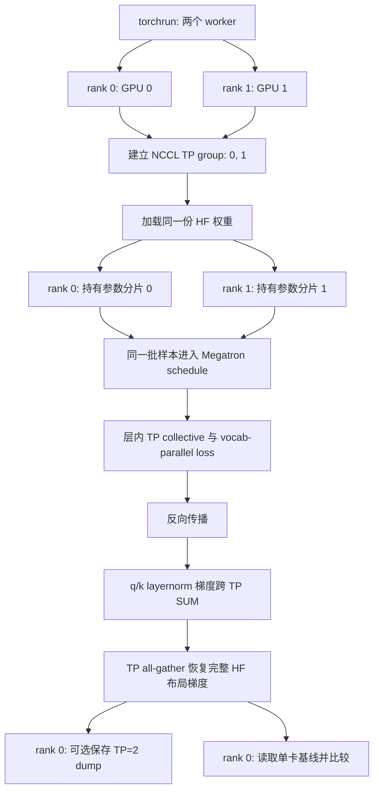
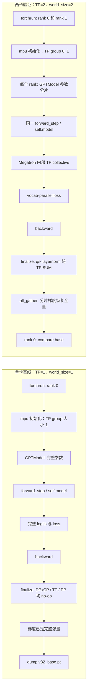

# TP=2 与单卡基线的等价性验证

本文解释两卡 Tensor Parallel（TP）如何相对单卡基线验证数值等价。执行顺序必须先生成基线，再运行 TP=2 比较。

第一步，生成唯一的无模型并行参照：

```bash
torchrun --nproc_per_node=1 scripts/test/test_v8.2_parallel.py \
    --fp32 --dump /tmp/v82_base.pt
```

第二步，运行 TP=2，并读取第一步的参照：

```bash
torchrun --nproc_per_node=2 scripts/test/test_v8.2_parallel.py \
    --fp32 --tp 2 --backend nccl \
    --compare /tmp/v82_base.pt
```

如需保留 TP=2 的完整梯度快照，可在第二条命令附加可选参数：

```text
--dump /tmp/v82_tp2.pt
```

但它不参与比较；`--compare /tmp/v82_base.pt` 才是 TP=2 等价性验收所必需的输入。

完整的通用 Megatron schedule 调用链见 [Megatron Core 调用链](megatron-call-chain-explained.md)。本文只讲 TP=2 相对基线的差异。

## 0. 先看真正的区别：外层调用相同，函数内部行为不同

你在两条命令中都会看到同一条外层调用：

```text
main -> MegatronTrainer -> train_batch -> Megatron schedule
     -> forward_step -> GPTModel -> loss_func -> backward
     -> finalize_model_grads -> 收集 grads
```

这不是巧合。测试故意复用完全相同的训练入口，才能把通过或失败归因于 `TP=2`，而不是另一套训练代码。差异不在“是否调用 `train_batch()`”，而在同一调用点内部是否真的发生 TP 分片与跨卡通信。



这张图中的分界线是：

```text
调用前：单卡拿完整参数；TP=2 的两个 rank 各拿参数分片
调用中：单卡没有 TP 通信；TP=2 在 Megatron Core 内做 TP collective
反向后：单卡梯度已完整；TP=2 还要补 q/k layernorm 梯度并 gather 供验收比较
```

## 1. 完整调用链：从命令到 compare

下面按实际执行顺序展开。`[相同]` 表示两条命令调用相同项目函数，`[TP=2 差异]` 表示同一节点内部的分支或通信发生变化。

```text
torchrun --nproc_per_node=2
  -> 启动 rank 0 和 rank 1；分别设置 LOCAL_RANK=0/1                         [TP=2 差异]
  -> scripts/test/test_v8.2_parallel.py:391 -> main()
       -> argparse.parse_args()                                                [相同]
       -> MegatronTrainer(..., tp=2, backend='nccl')                           [TP=2 差异]
            -> dist.init_process_group('nccl')                                [TP=2 差异]
            -> mpu.initialize_model_parallel(tp=2, pp=1, cp=1)                [TP=2 差异]
            -> GPTModel(...)                                                   [相同调用；参数布局不同]
            -> load_hf_into_megatron(...)                                      [相同调用；各 rank 写自己的分片]
       -> _make_samples(trainer)                                               [相同；两个 TP rank 获得相同样本]
       -> trainer.train_batch(samples, gbs=4, micro=4)                         [相同]
            -> _build_batch(...)                                               [相同；不走 CP 切分]
            -> get_forward_backward_func()                                     [相同；PP=1 都选 no-pipeline]
            -> forward_backward_no_pipelining(...)                             [相同]
                 -> self.forward_step(...)                                     [相同]
                      -> self._forward_logits(...)                             [相同]
                           -> self.model(...)                                  [TP=2 差异：Megatron TP 层内通信]
                      -> partial(self.loss_func, batch)                        [相同]
                 -> self.loss_func(...)                                        [相同]
                      -> fused_vocab_parallel_cross_entropy(..., tp_group)    [TP=2 差异：TP group 大小 2]
                 -> torch.autograd.backward(...)                               [相同]
                 -> self._finalize_model_grads()                               [相同 callback]
                      -> DPxCP AVG                                             [两者均 no-op]
                      -> TP q/k layernorm SUM                                 [TP=1 no-op；TP=2 执行]
                      -> PP tied embedding SUM                                [两者均 no-op]
            -> clip_grad_norm_() / AdamW.step()                                [相同；TP=2 使用已规约的梯度]
       -> _grads_in_hf_layout(...)                                             [相同调用]
            -> all_gather_param(...)                                           [TP=1 直接返回；TP=2 真 all-gather]
            -> convert_qwen3_to_hf(...)                                        [相同]
       -> torch.save('/tmp/v82_tp2.pt')                                        [可选：若指定，发生在 compare 前]
       -> torch.load('/tmp/v82_base.pt') + _compare(...)                       [TP=2 独有]
```

主要跳转点：

- [脚本入口与 `MegatronTrainer` 创建](../../scripts/test/test_v8.2_parallel.py#L211-L256)
- [并行组初始化](../../toy_rl/trainer/megatron_trainer.py#L254-L306)
- [HF 权重载入到本 rank 分片](../../toy_rl/trainer/megatron_trainer.py#L378-L392)
- [进入 Megatron schedule](../../toy_rl/trainer/megatron_trainer.py#L867-L881)
- [Megatron schedule 回调项目 `forward_step`](../../.venv/lib/python3.13/site-packages/megatron/core/pipeline_parallel/schedules.py#L431-L453)
- [项目进入 `GPTModel`](../../toy_rl/trainer/megatron_trainer.py#L564-L595)
- [TP vocab-parallel loss](../../toy_rl/trainer/megatron_trainer.py#L597-L623)
- [反向后 TP q/k layernorm SUM](../../toy_rl/trainer/megatron_trainer.py#L726-L751)
- [TP 分片梯度还原为 HF 布局](../../scripts/test/test_v8.2_parallel.py#L111-L153)
- [dump 与 compare](../../scripts/test/test_v8.2_parallel.py#L356-L382)

## 2. 配置变化

| 项目 | 单卡基线 | 当前 TP=2 命令 | 含义 |
|---|---:|---:|---|
| `--nproc_per_node` | 1 | 2 | 启动两个 worker，各绑定一张 GPU |
| backend | `gloo` | `nccl` | 跨 GPU collective 使用 NCCL |
| TP | 1 | 2 | 每层的可切分矩阵分到两张卡 |
| PP | 1 | 1 | 所有层仍在每个 rank 的模型 stage 中；无 pipeline p2p |
| CP | 1 | 1 | 序列不切分；无 ring attention |
| DP | 1 | 1 | 不做数据并行；两个 rank 处理相同样本 |
| dtype | fp32 | fp32 | 以严格数值门比较结果 |

TP、PP、CP 参数由测试脚本传给训练器：[调用点](../../scripts/test/test_v8.2_parallel.py#L244-L256)。训练器据此计算各并行大小：[计算与约束](../../toy_rl/trainer/megatron_trainer.py#L272-L280)，然后初始化 Megatron Core 的并行组：[`mpu.initialize_model_parallel`](../../toy_rl/trainer/megatron_trainer.py#L286-L306)。

当前配置满足：

```text
world_size = 2
TP = 2
PP = 1
CP = 1
DP = world_size / (TP x PP x CP) = 1
TP group = [0, 1]
```

## 3. 两个 rank 做的不是两份独立训练

这是最重要的区别。

```text
DP=2：rank 0 与 rank 1 处理不同样本，各自有完整模型副本
TP=2：rank 0 与 rank 1 处理相同样本，各自只有模型参数的一部分
```

因此两个 TP rank 都会从 [`_make_samples()`](../../scripts/test/test_v8.2_parallel.py#L86-L108) 得到相同的四条确定性样本；没有样本切分，也不发生 DP 梯度同步。

每个 worker 各自执行测试脚本，但 `torchrun` 注入不同的 `RANK` 与 `LOCAL_RANK`。训练器按 `LOCAL_RANK` 选择对应 GPU：[设备绑定逻辑](../../toy_rl/trainer/megatron_trainer.py#L261-L270)。

## 4. 模型和 HF 权重如何变成 TP 分片

两张卡都创建 Megatron Core 的 `GPTModel`，但每张卡只保留其 TP 分片：

- [创建 `GPTModel`](../../toy_rl/trainer/megatron_trainer.py#L345-L371)
- [读取 HF 权重并调用 `load_hf_into_megatron`](../../toy_rl/trainer/megatron_trainer.py#L378-L392)
- [`load_hf_into_megatron`](../../toy_rl/trainer/megatron_to_hf.py#L421-L478)

典型分片规则：

| 参数类别 | TP 切分维度 | rank 0 / rank 1 的关系 |
|---|---|---|
| embedding、QKV、MLP `fc1` | dim 0，column-parallel | 各保留输出通道的一半 |
| attention `o_proj`、MLP `fc2` | dim 1，row-parallel | 各保留输入通道的一半 |
| 普通 RMSNorm | 不切分 | 两卡都有副本 |
| q/k layernorm | 不切分参数，但各卡只处理自己的 heads | 梯度需要额外 TP 求和 |

反向映射中的实际切分在 [`hf_to_megatron_state_dict`](../../toy_rl/trainer/megatron_to_hf.py#L306-L418)。尤其 `fc1` 不能直接把 `[gate; up]` 整块切开，必须先分别切 gate 和 up，再在各 rank 拼接：[`fc1` 处理](../../toy_rl/trainer/megatron_to_hf.py#L393-L400)。

## 5. 前向与 loss：层内并行，但数学不变

训练入口仍是 [`train_batch()`](../../toy_rl/trainer/megatron_trainer.py#L817-L911)，并继续交给 Megatron Core schedule。因为 `PP=1`，仍选无 pipeline schedule，不会产生 stage 间 send/recv。

区别出现在 `self.model(...)` 进入 Megatron Core `GPTModel` 后：[项目调用点](../../toy_rl/trainer/megatron_trainer.py#L564-L595)。每个 TP rank 计算自己的矩阵分片；Megatron Core 在需要合成激活的位置使用 TP group collective。层内通信由 Megatron Core 实现，而不是测试脚本手写。

输出词表维也按 TP 分片。项目不会把 logits 拼回完整词表，而是在 [`_vocab_parallel_log_probs`](../../toy_rl/trainer/megatron_trainer.py#L597-L623) 中调用：

```python
fused_vocab_parallel_cross_entropy(
    logits_shard.unsqueeze(1).contiguous(),
    targets.unsqueeze(1),
    self.tp_group,
)
```

该 kernel 在 TP group 内处理 max 与 sum-exp 的规约，因此拿到的每 token log-prob 与单卡完整 `log_softmax` 对应的结果相同。

## 6. 反向后，哪些规约真的执行

Megatron schedule 在 backward 后回调项目的 [`_finalize_model_grads`](../../toy_rl/trainer/megatron_trainer.py#L804-L813)。三处规约在当前配置中的状态为：

| 规约 | 当前是否执行 | 原因 |
|---|---|---|
| DP x CP 的全部梯度 AVG | 否 | `dp_cp_size=1` |
| TP q/k layernorm 梯度 SUM | 是 | `tp_size=2`，每卡只有部分 attention heads 的贡献 |
| PP tied embedding 梯度 SUM | 否 | `pp_size=1`，单卡内 PyTorch 已自动累加 tied-weight 两条路径 |

实际执行的是：

```python
dist.all_reduce(p.grad, op=dist.ReduceOp.SUM, group=self.tp_group)
```

仅对参数名含 `q_layernorm` 或 `k_layernorm` 的梯度执行，见 [`_allreduce_qk_layernorm_grads`](../../toy_rl/trainer/megatron_trainer.py#L726-L751)。这里必须是 `SUM`：两个 rank 分别对不同 heads 产生部分梯度，完整 layernorm 梯度是它们的和，不是平均。

三处规约的原理与 callback 过程见 [`finalize_model_grads_func` 与三处梯度规约](finalize-model-grads-explained.md)。

## 7. 为什么不能直接比较 rank 0 的梯度

TP=2 时，rank 0 的很多 `param.grad` 只有完整张量的一半，名称和形状都可能与单卡基线不同。例如 rank 0 的 `linear_qkv.weight.grad` 只覆盖它负责的 query/key/value head 分片。

因此脚本在训练后执行 [`_grads_in_hf_layout`](../../scripts/test/test_v8.2_parallel.py#L111-L153)：

```text
本地 Megatron 分片梯度
  -> all_gather_param：TP group 内拼回完整张量
  -> linear_fc1 的 gate/up 重排
  -> remove_padding：去掉可能的词表补齐行
  -> convert_qwen3_to_hf：恢复 HF 参数名和布局
  -> CPU float32 clone
```

关键实现：

- [测试脚本创建 grad shim 并调用 gather / convert](../../scripts/test/test_v8.2_parallel.py#L124-L142)
- [`all_gather_param`](../../toy_rl/trainer/megatron_to_hf.py#L67-L122)
- [`convert_qwen3_to_hf`](../../toy_rl/trainer/megatron_to_hf.py#L174-L237)

`all_gather_param()` 是 collective，所以两个 rank 都必须按同样顺序进入；虽然只有 rank 0 最终负责保存和比较，rank 1 不能跳过梯度收集。

## 8. 先生成基线，再 compare

正确的执行顺序是：

```text
步骤 1：单卡 TP=1 运行，rank 0 写入 /tmp/v82_base.pt
步骤 2：TP=2 运行，rank 0 读取 /tmp/v82_base.pt 并比较
```

如果基线文件不存在，第二步的 [`torch.load(args.compare)`](../../scripts/test/test_v8.2_parallel.py#L371-L382) 无法执行。基线运行不带 `--compare`，因此只执行 [`torch.save(..., args.dump)`](../../scripts/test/test_v8.2_parallel.py#L363-L369)。

TP=2 命令不需要 `--dump`。若附加 `--dump /tmp/v82_tp2.pt`，代码会先写该可选快照、再 compare，见 [`dump / compare` 的代码顺序](../../scripts/test/test_v8.2_parallel.py#L356-L382)；这不改变它仍依赖 `/tmp/v82_base.pt` 的事实。

参照配置与当前配置不同，因为至少：

```text
baseline: TP=1, backend=gloo
TP=2 run: TP=2, backend=nccl
```

两次都使用 `--fp32`，因此 [`_compare()`](../../scripts/test/test_v8.2_parallel.py#L156-L208) 使用严格门：

```text
loss |delta| < 1e-4
全局 grad rel_L2 < 5e-3
grad cosine > 0.9999
```

比较的是还原后的完整 HF 布局梯度，不是 TP 分片本身。通过意味着：参数切分、Megatron 内部 collective、q/k layernorm 规约、以及 TP 梯度还原这几部分共同保持了单卡训练数学。
