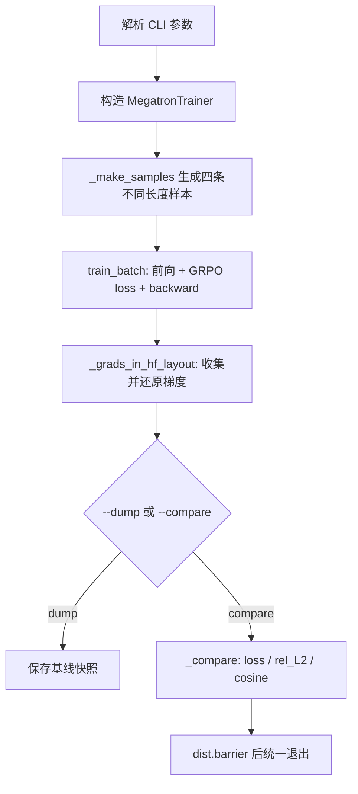

# V8.2 多维并行验收脚本导读

本文解释 [`scripts/test_v8.2_parallel.py`](../scripts/test_v8.2_parallel.py) 如何验证
Megatron 的张量并行（TP）、流水线并行（PP）、上下文并行（CP）及其组合。

它不是日常训练入口，而是一个**数值等价性验收器**：同一组样本分别在无模型并行的单卡基线和
目标并行配置上运行，再比较 loss 与梯度。目标是回答：并行改变了计算和通信的分布方式，但有没有
改变训练数学。

相关实现：

- [`toy_rl/trainer/megatron_trainer.py`](../toy_rl/trainer/megatron_trainer.py)：构造本 rank 的 Megatron 模型，并执行前向、反向和梯度规约。
- [`toy_rl/trainer/megatron_to_hf.py`](../toy_rl/trainer/megatron_to_hf.py)：TP/PP 分片权重和梯度与 HF 布局之间的转换。
- [`toy_rl/trainer/cp_utils.py`](../toy_rl/trainer/cp_utils.py)：CP 的 2-chunk 对称切分。
- [`docs/decisions/v8.2.md`](decisions/v8.2.md)：本版的设计决策、服务器验收记录和已知边界。

## 1. 参照系与启动方式

所有门都以没有模型并行的配置为参照：

```text
TP=1, PP=1, CP=1
```

这个配置中的模型参数、序列和层都没有被切分，因此是最直接的正确性基线。`torchrun` 只负责
创建分布式进程；真正决定如何切模型的是 `MegatronTrainer` 接收的 TP、PP、CP 参数：

$$
\text{world size} = TP \times PP \times CP \times DP
$$

例如，四个进程采用 `TP=2, PP=2, CP=1` 时，数据并行大小为 1；同样的四个进程采用
`TP=1, PP=1, CP=1` 时，数据并行大小则为 4。

常用验收命令在脚本模块注释中已经按 G1--G6 给出。其共同模式是：

```bash
# 先保存单卡参照结果
torchrun --nproc_per_node=1 scripts/test_v8.2_parallel.py \
  --fp32 --dump /tmp/v82_base.pt

# 再运行某种并行配置，与参照结果比较
torchrun --nproc_per_node=2 scripts/test_v8.2_parallel.py \
  --fp32 --tp 2 --backend nccl \
  --compare /tmp/v82_base.pt
```

`--dump` 保存 loss、全局梯度和配置；`--compare` 加载该快照并执行硬门。脚本还会拒绝
“与相同配置比较”，防止无意义的自比较让结果恒绿。

## 2. 一次运行的数据流



### 2.1 构造有判别力的样本

`_make_samples()` 固定构造四条长度不同的数学问答，并按照 prompt/response 边界设置
`loss_mask`：prompt 为 0，response 为 1。四条不同长度的序列既覆盖 padding/packing，
也让 CP 切分不是一个平凡的等长情况。

每条样本还带有人造的 `old_log_probs`。GRPO 的重要性采样比为：

$$
r_t = \exp(\log p_\theta(a_t \mid s_t) - \log p_{\mathrm{old}}(a_t \mid s_t))
$$

如果旧策略和当前策略完全相同，$r_t=1$，loss 的数值可能退化为常数，导致 loss 不能检验
前向计算。合成但确定性的旧 log-prob 使 ratio 不等于 1，因此**loss 和梯度都成为比较对象**。

### 2.2 前向、GRPO loss 与反向

```python
metrics = trainer.train_batch(samples, global_batch_size=gbs, microbatch_size=micro)
```

脚本通过 `MegatronTrainer.train_batch()` 间接使用 Megatron 的
`get_forward_backward_func()`。这点很重要：PP 并不是脚本手写 `send/recv`，而是由 Megatron
调度器处理 stage 间通信和 1F1B 时序。

PP 启用时，脚本把 `microbatch_size` 设为 1。四条样本会变成四个微批，调度因而经过
warmup、steady 和 cooldown；如果整批只作为一个微批，流水线会退化，覆盖不到 1F1B 的关键路径。

### 2.3 把梯度还原到同一个坐标系

不同并行配置中本 rank 能看到的梯度形状不同：

- TP 切分 `qkv`、MLP 等线性层，词表 logits 也可能分片。
- PP 的每个 stage 只拥有一部分层。
- GLU 的 `fc1` 使用交错分片布局，不能直接拼接。

因此 `_grads_in_hf_layout()` 不能直接比较 `param.grad`。它按下面的顺序处理：

1. `_local_params_by_global_name()` 找到本 stage 的局部参数。
2. 用轻量 `SimpleNamespace` 将 `param.grad` 包装成与参数元数据兼容的对象。
3. 复用 `all_gather_param()` 完成 TP gather 和 GLU 重排。
4. 用 `remove_padding()` 去除 vocab-parallel 对齐时增加的词表 padding。
5. 用 `convert_qwen3_to_hf()` 转为 HF 名称与张量布局。
6. PP 大于 1 时，通过 PP group 的 `all_gather_object()` 合并各 stage 的梯度字典。

最后得到的是每种配置都可直接比较的 `dict[str, Tensor]`。这里的 gather 只服务验收，
不属于训练时的梯度通信路径。

## 3. 比较指标与精度分层

`_compare()` 依次验证梯度名字集合、各张量形状、loss 差异和全局梯度接近程度。

相对 $L_2$ 误差定义为：

$$
\mathrm{rel\_L2} =
\frac{\lVert g_{\mathrm{ref}} - g_{\mathrm{test}} \rVert_2}
{\max(\lVert g_{\mathrm{ref}} \rVert_2, 10^{-12})}
$$

余弦相似度为：

$$
\cos(g_{\mathrm{ref}}, g_{\mathrm{test}}) =
\frac{g_{\mathrm{ref}} \cdot g_{\mathrm{test}}}
{\lVert g_{\mathrm{ref}} \rVert_2 \lVert g_{\mathrm{test}} \rVert_2}
$$

全模型梯度不会被 `cat` 成一个大向量。脚本逐张量累积平方差、点积和范数，原因是全 28 层
模型的两个 `float64` 大向量会占用约 10 GB CPU 内存。该累加与先拼接再计算全局 $L_2$/cosine
在数学上等价。

| 档位 | 适用门 | 硬判据 | 含义 |
|---|---|---|---|
| fp32 | G1、G2、G3a、G4 | loss $<10^{-4}$、rel_L2 $<5\times10^{-3}$、cosine $>0.9999$ | 并行计算只有浮点规约顺序差异，是强正确性证据。 |
| bf16 | G3b（CP） | loss $<10^{-4}$、cosine $>0.999$ | bf16 舍入会累积，rel_L2 仅报告，不作为硬门。 |

脚本还打印“最差参数”。它不作为 pass/fail 门，但它是很有效的故障指纹：

- `q_norm.weight` 异常，通常表示漏了跨 TP 的 qk-layernorm 梯度规约。
- `embed_tokens.weight` 异常，通常表示 PP 下 tied embedding 的跨 stage 规约缺失。

## 4. G1--G6 验收门

| 门 | 配置与目的 | 主要捕获的问题 |
|---|---|---|
| G1 | NCCL 下 TP=2 对比单卡基线 | 改用多卡 NCCL 后的 TP 分片或规约错误。 |
| G2 | PP=2 对比单卡基线 | PP 1F1B、跨 stage 激活传递、tied embedding 梯度规约。 |
| G3a | THD packing 对比 BSHD padding，CP=1 | 只改变布局，验证 TE/packing 前向路径。 |
| G3b | CP=2 对比 CP=1，THD + flash | 2-chunk 切分、CP loss 分母和 DP×CP 梯度规约。 |
| G3c | 把正确 CP 切分故意替换为连续切分 | 验证指标确实能把错误实现判红。 |
| G4 | TP=2 × PP=2 对比单卡基线 | 多并行轴组合时的整体正确性。 |
| G5 | 检查 TP/PP/CP group 的真实 rank | TP group 是否位于同一 NUMA 节点，避免高频 all-reduce 走跨 root-complex 链路。 |
| G6 | PP 下 Megatron 到 HF 的往返 | 局部层号、TP gather、PP broadcast 和重命名/重排是否逐值正确。 |

G3 的证据边界需要单独说明：CP 大于 1 时必须走 TransformerEngine 的 FlashAttention 路径，
而 FA2 内核不接受 fp32。因此 G3b 不能使用 fp32 精确门，只能以 bf16 的正例加 G3c 的
negative control 共同建立证据。G3a 则使用 `unfused` 后端，仍可独立提供 fp32 的 packing
等价证明。

## 5. Negative Control 为什么是硬要求

`--negative-control` 会在创建 trainer 前设置：

```python
os.environ["NANO_CP_NAIVE_SPLIT"] = "1"
```

这会让 CP 从正确的 2-chunk 对称切分退化为错误的朴素连续切分。此时 `_compare()` 不期待
cosine 很高，反而要求：

```python
cos < 0.99
```

若错误实现仍然“通过”，就说明当前阈值或指标没有判别力，前面的正例通过也没有价值。
这是 V7.6 引入并沿用的验收纪律：**正例只能说明没有看见错误；负例被拒绝才能说明测试有能力看见错误。**

## 6. 两个容易误读的执行细节

### 6.1 G6 必须在训练前比较

`--convert` 的 Megatron 到 HF 转换只做 reshape、split、cat 和 rename，不应产生任何数值误差，
因此门是：

```text
max_abs_diff == 0
```

该检查安排在 `train_batch()` 前。如果先执行训练，`optimizer.step()` 会按学习率更新参数；随后
再与原始 HF checkpoint 比较，约 $10^{-6}$ 的差异看似转换误差，实际只是训练更新。

### 6.2 PP 的 loss 只在最后一个 stage 产生

Megatron 的 pipeline schedule 只在 PP last stage 上调用 loss 函数。脚本和训练器需要把该 loss
广播回相关进程，才能让 rank 0 稳定地报告与比较它。若 rank 0 位于 first stage 而直接读取局部
loss，会看到 0；这表示“数值在另一个进程”，不表示“模型算错”。

## 7. 如何阅读一次失败

先看失败所属的门，再结合指标与最差参数定位：

| 现象 | 优先检查方向 |
|---|---|
| loss 近似一致，但 fp32 梯度系统性偏离 | 某处跨 rank 梯度规约遗漏；优先看最差参数名称。 |
| G2 中 `embed_tokens.weight` 最差 | tied word embedding 在 PP first/last stage 间没有正确求和。 |
| G1/G4 中 `q_norm.weight` 最差 | qk-layernorm 的 TP 梯度规约遗漏。 |
| G3b 正例和 G3c 反例同样通过 | CP 测量没有判别力，不能据此声明 CP 正确。 |
| CP 下后端不是 FlashAttention | 停止比较；CP 在本项目硬件上的正确性前提未满足。 |
| G6 出现约学习率大小的差异 | 确认是否把转换检查放到了 `optimizer.step()` 之后。 |

完整的已验证数值、硬件前提和偏离登记见 [`docs/decisions/v8.2.md`](decisions/v8.2.md)。