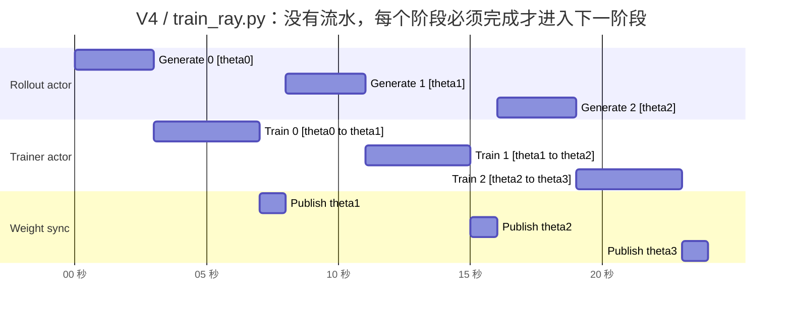
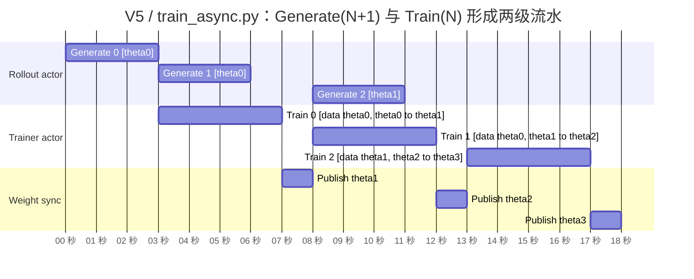

# V5 核心代码对比：`train_async.py` vs `train_ray.py`

这篇只解释两份入口代码：

- `mini_slime/train_ray.py`：V4 的 Ray 同步主循环，也就是 V5 的同步基线。
- `mini_slime/train_async.py`：V5 的 Ray 异步主循环。

一句话结论：**V5 没有改 rollout、trainer、Ray actor 的角色拆分，核心只改了主循环里 `generate.remote(...)` 和 `ray.get(...)` 的相对位置**。同步版是“生成完再训练”；异步版是“拿到当前生成结果后，立刻发起下一轮生成，再训练当前数据”，让 `train(N)` 和 `generate(N+1)` 在不同 Ray actor 进程里同时跑。

## 先看共同部分

两份代码开头的装配几乎一样：

```python
create_placement_groups(args)
rollout_manager = create_rollout_manager(args)
actor_model, _critic = create_training_models(args)
actor_model.async_init(args)
actor_model.update_weights()
```

它们做的是同一件事：

| 步骤 | 含义 |
|---|---|
| `create_placement_groups(args)` | 初始化 Ray。nano 版不做真 GPU placement group，只保证 Ray runtime 就绪。 |
| `create_rollout_manager(args)` | 创建一个 RolloutManager Ray actor。生成数据在这个独立进程里跑。 |
| `create_training_models(args)` | 创建 RayTrainGroup，里面持有训练 worker actor。训练在训练 actor 进程里跑。 |
| `actor_model.async_init(args)` | 初始化训练 actor 里的 Trainer。 |
| `actor_model.update_weights()` | 训练开始前先把训练侧权重同步给推理侧，所以初始 `weight_version` 从 1 起步。 |

所以 V5 不是“换了一套系统”，而是在 V4 已经拆进程的基础上，把调度顺序改成可以 overlap。

## Ray 里两个关键词

读这两份代码时，先抓住两个 Ray 语义：

```python
ref = actor.method.remote(...)
```

这句通常只是“提交任务”，立刻返回一个 `ObjectRef`，不代表任务已经完成。

```python
result = ray.get(ref)
```

这句才是“等待任务完成并取结果”。所以**异步不异步，关键不是有没有 `.remote()`，而是 `ray.get` 放在哪里**。

## `train_ray.py`：同步版主循环

同步版核心代码在 `mini_slime/train_ray.py` 的循环里：

```python
for rollout_id in range(args.num_rollout):
    rollout_data = ray.get(rollout_manager.generate.remote(rollout_id))

    train_metrics = ray.get(actor_model.async_train(rollout_id, rollout_data))

    if (rollout_id + 1) % args.update_weights_interval == 0:
        actor_model.update_weights()
```

它的时序是：

```text
rollout 0: generate(0) 等完 -> train(0) 等完 -> update_weights()
rollout 1: generate(1) 等完 -> train(1) 等完 -> update_weights()
rollout 2: generate(2) 等完 -> train(2) 等完 -> update_weights()
```

也就是：

```text
时间轴:
gen0 | train0 | sync0 | gen1 | train1 | sync1 | gen2 | train2 | sync2
```

下面按计算机组成原理常见的“功能部件 + 时间轴”方式画。两图都从训练前的初始 `update_weights()` 已将 `theta0` 发布到 rollout/inference 侧开始。图以默认 `update_weights_interval = 1` 为例：一次生成占 3 个时间格、一次训练占 4 个时间格、权重同步占 1 个时间格；真实耗时可以不同，但串行与重叠关系不变。



即使 rollout actor 和 trainer actor 已经是不同进程，主进程也每一步都用 `ray.get` 等住了：

- `ray.get(rollout_manager.generate.remote(rollout_id))`：必须等当前 rollout 数据生成完。
- `ray.get(actor_model.async_train(...))`：必须等当前训练完成。
- 下一轮 `generate(rollout_id + 1)` 要等本轮训练和同步都结束后才会发起。

所以 V4 的价值是“角色已经拆成 Ray 进程”，但执行仍然串行。

## `train_async.py`：异步版主循环

异步版核心多了一个变量：

```python
rollout_data_next_future = rollout_manager.generate.remote(0)
```

这个变量名很关键：它不是 rollout 数据本身，而是“下一份 rollout 数据的 future / ObjectRef”。也就是说，`generate(0)` 在进入循环前就已经被提交给 rollout actor 运行了。

循环内部是：

```python
for rollout_id in range(args.num_rollout):
    if rollout_data_next_future is not None:
        rollout_data_curr = ray.get(rollout_data_next_future)

    if rollout_id + 1 < args.num_rollout:
        rollout_data_next_future = rollout_manager.generate.remote(rollout_id + 1)

    train_metrics = ray.get(actor_model.async_train(rollout_id, rollout_data_curr))

    if (rollout_id + 1) % args.update_weights_interval == 0:
        rollout_data_curr = ray.get(x) if (x := rollout_data_next_future) is not None else None
        rollout_data_next_future = None
        actor_model.update_weights()
```

读法分四步：

| 步骤 | 代码 | 含义 |
|---|---|---|
| 0 | 循环外 `generate.remote(0)` | 先把第 0 轮 rollout 发出去。 |
| 1 | `ray.get(rollout_data_next_future)` | 取回已经发起的当前轮数据。第 0 轮一般需要等；后续可能已经被上一轮训练藏住了。 |
| 2 | `generate.remote(rollout_id + 1)` | **马上发起下一轮生成**。这是 V5 最核心的一行。 |
| 3 | `ray.get(actor_model.async_train(...))` | 训练当前轮数据。此时下一轮生成已经在 rollout actor 进程里跑。 |
| 4 | 更新权重前 `ray.get` 在途生成 | 如果到了同步权重的 interval，先确保正在生成的那一轮已经结束，再换权重。 |

异步版的时序更像这样：

```text
先发起: generate(0)

rollout 0:
  等 generate(0)
  发起 generate(1)
  train(0)       与 generate(1) overlap
  等 generate(1) 结束
  update_weights()

rollout 1:
  使用刚才已经取好的 generate(1) 数据
  发起 generate(2)
  train(1)       与 generate(2) overlap
  等 generate(2) 结束
  update_weights()

rollout 2:
  使用刚才已经取好的 generate(2) 数据
  没有下一轮可发起
  train(2)
  update_weights()
```

画成时间轴：

```text
同步 V4:
gen0 | train0 | sync0 | gen1 | train1 | sync1 | gen2 | train2 | sync2

异步 V5:
gen0 | train0 | sync0 | train1 | sync1 | train2 | sync2
       gen1 ---------^  gen2 ---------^
```

V5 则把 rollout actor 和 trainer actor 当作两个流水段：当前数据一到手，Driver 就立即给 rollout actor 投递下一条指令，然后 trainer actor 消费当前数据。图中的两条横条重叠，才是 V5 节省 wall-clock 时间的来源。



`Generate 1 [theta0]` 与 `Train 0 [theta0 to theta1]` 重叠，`Generate 2 [theta1]` 与 `Train 1 [theta1 to theta2]` 重叠。只要 rollout actor 和 trainer actor 是不同进程，就能真实并行。图中生成比训练短，因此 `Publish theta1` 直接跟在 `Train 0` 后面；若生成更慢，则这里会先等待 `Generate 1` 的尾部完成。

## 参数版本：V5 故意引入一拍滞后

你的判断是对的：**`Generate 0` 和 `Generate 1` 都由同一份 rollout/inference 参数 `theta0` 生成。** 原因不是两个任务共享同一份数据，而是 `Generate 1` 在 `Train 0` 和 `Publish theta1` 之前就已提交：

```text
初始同步：rollout/inference 侧加载 theta0
Generate 0：使用 theta0，得到 D0
Generate 1：使用 theta0，得到 D1      <- 与 Generate 0 相同的参数版本
Train 0：   用 D0，把训练侧 theta0 更新为 theta1
Publish：   把 theta1 推给 rollout/inference 侧
Generate 2：使用 theta1，得到 D2
```

所以 `Train 1` 的输入是 `D1(theta0)`，但训练模型已经是 `theta1`；它会从 `theta1` 继续更新到 `theta2`。在默认 interval 为 1 时，这就是一步 **staleness**，也是 V5 用来换取流水并行的代价。

若 `update_weights_interval = k`，推理侧会连续做 `k + 1` 个旧版本 rollout（最后一个是更新前已经提前发起的 future）；其中最旧的这份 future 可能在训练侧已经做完 `k` 次更新后才被消费。因此 interval 越大，权重同步开销越低，但 rollout 数据相对当前训练参数的滞后上限也越高。

同步版没有这个滞后：它先完成 `Train 0` 并发布 `theta1`，才允许 `Generate 1` 开始，因此每一轮数据都由当轮训练开始时的同版本参数生成。

注意本 mini 复现的 `weight_version` 是 `WeightUpdater` 的同步计数器，初始同步后是 1；图中的 `theta0` 表示算法语义上的初始模型参数。二者都按同步递增，但下标相差 1，不能把日志中的 `weight_v=1` 直接读成 `theta1`。此外，当前 `Trainer.train()` 是 fake 训练，不会真的更新参数张量；图中的 `theta0 to theta1` 是 V5 在真实 FSDP/Megatron 训练中的参数语义，用来解释调度造成的数据版本滞后。

## 最绕的一段：为什么更新权重要先 `ray.get`

异步版里这段很容易看懵：

```python
if (rollout_id + 1) % args.update_weights_interval == 0:
    rollout_data_curr = ray.get(x) if (x := rollout_data_next_future) is not None else None
    rollout_data_next_future = None
    actor_model.update_weights()
```

它解决的是一个语义问题：**不能在 rollout actor 正在生成时突然同步新权重**。

如果不等在途生成，可能出现这种混乱：

```text
generate(1) 已经用旧权重开始生成
train(0) 结束
主循环立刻 update_weights()
generate(1) 生成过程中推理侧权重被换掉
```

这会让一份 rollout 数据里潜在混入不同权重版本的行为。真实系统里这是很危险的，所以源项目的异步训练也会在更新权重前先 sync 掉 generate。

这段代码还有一个隐藏效果：它把下一轮数据提前取出来，留给下一次循环使用。

以默认 `update_weights_interval = 1` 为例：

```text
循环 0:
  train(0) 前发起 generate(1)
  train(0) 后，为了 update_weights，先 ray.get(generate(1))
  此时 rollout_data_curr 变成第 1 轮数据
  rollout_data_next_future = None
  update_weights()

循环 1:
  开头发现 rollout_data_next_future 是 None，所以不取 future
  但 rollout_data_curr 还保存着上轮末尾取到的第 1 轮数据
  所以可以直接用它 train(1)
```

这就是这份代码最不直观的地方：**`rollout_data_curr` 有时在循环开头赋值，有时在上一轮循环末尾赋值**。

如果把这个变量换个名字，逻辑会更容易读：

```text
rollout_data_next_future: 正在跑、还没取的数据
rollout_data_curr: 已经取到、准备训练的数据
```

把它放回上面的流水线图看即可：`Generate 1` 已经在 `Train 0` 的时间段内完成。更新权重时，主循环把它从“在途槽位”取出并放进 `rollout_data_curr`，作为下一拍 `Train 1` 的输入。

## V5 到底省了什么时间

同步版每轮大致是：

```text
总时间 ~= gen0 + train0 + gen1 + train1 + gen2 + train2
```

异步版大致是：

```text
总时间 ~= gen0 + max(train0, gen1剩余等待) + max(train1, gen2剩余等待) + train2
```

更直观地说，异步版想省掉的是：

```text
train(N) 的时间，被 generate(N+1) 的时间窗口藏起来
```

本仓库 nano 版的 Trainer 不跑真梯度，训练本来几乎是 0 秒。为了让 V5 的 overlap 在测试里可观测，V5 还加了两个模拟耗时参数：

| 参数 | 位置 | 作用 |
|---|---|---|
| `fake_train_seconds` | `mini_slime/args.py`、`mini_slime/trainer.py` | 用 `time.sleep` 模拟真 FSDP/Megatron 训练一步的 wall-clock。 |
| `fake_gen_seconds` | `mini_slime/args.py`、`toy_rl/agent/stub_hooks.py` | 离线 stub 里用 `asyncio.sleep` 模拟 SGLang 生成耗时。服务器真 SGLang 路径不用它。 |

所以 V5 的测试不是在证明 fake trainer 真的训练更快，而是在证明：**当训练耗时真实存在时，调度顺序可以把这段耗时和下一轮生成重叠起来**。

## 两份代码的字段也变了

同步版记录：

```python
{
    "gen_time": ...,
    "train_time": ...,
    "sync_time": ...,
}
```

异步版记录：

```python
{
    "wait_gen_time": ...,
    "train_time": ...,
}
```

注意：`wait_gen_time` 不是完整的生成耗时，而是“主循环在取当前 future 时还需要等多久”。

如果上一轮训练已经把下一轮生成完整藏住了，那么下一轮开头：

```python
rollout_data_curr = ray.get(rollout_data_next_future)
```

会几乎立刻返回，日志里就会看到：

```text
wait_gen=0.000s
```

这不是说生成没花时间，而是说生成已经在上一轮训练期间完成了。

## 对比表

| 问题 | `train_ray.py` 同步版 | `train_async.py` 异步版 |
|---|---|---|
| 第 0 轮生成何时发起 | 循环内发起，然后马上 `ray.get` 等完 | 循环前预先发起 `generate(0)` |
| 下一轮生成何时发起 | 本轮训练和同步都结束后 | 本轮训练开始前 |
| `train(N)` 能否和 `generate(N+1)` 并行 | 不能 | 能 |
| 是否会同时发起多个 rollout | 不会 | 也不会，最多一个在途 future |
| 更新权重前是否需要等在途生成 | 没有在途生成，所以不需要额外处理 | 需要，先 `ray.get` 在途生成，再 `update_weights()` |
| 主要指标 | `gen_time`、`train_time`、`sync_time` | `wait_gen_time`、`train_time` |
| 语义代价 | 数据最新，但串行慢 | 默认 interval=1 时下一轮 rollout 使用旧权重；interval 更大时 staleness 上限也更高 |

## 最小心智模型

可以把 V5 理解成一个“双缓冲”训练循环：

```text
buffer/current: 当前已经生成好的 rollout 数据，用来 train(N)
future/next:    下一轮正在生成的数据，用来 train(N+1)
```

同步版是：

```text
生成 current -> 训练 current -> 生成 current -> 训练 current
```

异步版是：

```text
先启动 next
取 next 作为 current
立刻启动新的 next
训练 current，同时 next 在后台生成
```

这就是 V5 的核心改动。
